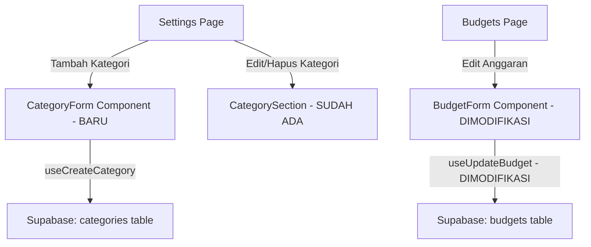

# Dokumen Desain: Budget Category Enhancements

## Ikhtisar

Dokumen ini menjelaskan desain teknis untuk dua peningkatan fitur pada FinTrack:
1. Menambahkan UI untuk membuat kategori kustom baru di halaman pengaturan (saat ini hanya ada edit dan hapus).
2. Mengaktifkan field bulan pada formulir edit anggaran agar pengguna dapat memindahkan anggaran ke bulan lain.

Kedua perubahan ini bersifat inkremental dan memanfaatkan infrastruktur yang sudah ada (hook `useCreateCategory`, tipe `BudgetFormInput`, dan Supabase backend).

## Arsitektur

Perubahan ini mengikuti arsitektur yang sudah ada pada FinTrack:



Tidak ada perubahan arsitektur besar. Semua perubahan terjadi di layer komponen UI dan hook data.

## Komponen dan Antarmuka

### 1. CategoryForm (Komponen Baru)

Komponen modal form untuk membuat kategori kustom baru.

```typescript
// src/components/categories/CategoryForm.tsx
interface CategoryFormProps {
  open: boolean;
  onClose: () => void;
  onSubmit: (data: CategoryFormInput) => void;
  loading?: boolean;
}
```

Komponen ini akan:
- Menampilkan field input untuk nama kategori (teks) dan ikon (emoji/teks)
- Melakukan validasi: nama tidak boleh kosong atau hanya spasi
- Menggunakan komponen `Modal` dan `Button` yang sudah ada

### 2. CategorySection (Modifikasi)

Menambahkan tombol "Tambah Kategori" di bagian atas `CategorySection` pada halaman pengaturan, yang membuka `CategoryForm`.

```typescript
// Perubahan di src/app/(protected)/settings/page.tsx - CategorySection
// Tambahkan state untuk form dan integrasi useCreateCategory
const [formOpen, setFormOpen] = useState(false);
const createCategory = useCreateCategory();
```

### 3. BudgetForm (Modifikasi)

Mengubah field bulan agar tidak di-disable saat mode edit.

```typescript
// Perubahan di src/components/budgets/BudgetForm.tsx
// Sebelum:
disabled={isEdit}  // pada input month

// Sesudah:
// Hapus disabled={isEdit} pada input month
// Field bulan selalu dapat diedit
```

### 4. useUpdateBudget Hook (Modifikasi)

Memperluas hook untuk mendukung pembaruan field `month` selain `limit_amount`.

```typescript
// Perubahan di src/hooks/useBudgets.ts
interface UpdateBudgetInput {
  id: string;
  limit_amount: number;
  month?: string;  // field baru, opsional
}

// mutationFn akan meng-update month jika disediakan
const updateFields: Record<string, unknown> = {
  limit_amount,
  updated_at: new Date().toISOString(),
};
if (month) {
  updateFields.month = month;
}
```

### 5. BudgetsPage (Modifikasi)

Mengubah handler `handleEdit` untuk mengirim data bulan ke hook update.

```typescript
// Perubahan di src/app/(protected)/budgets/page.tsx
const handleEdit = (data: { category_id: string; month: string; limit_amount: number }) => {
  if (!editingBudget) return;
  updateBudget.mutate(
    {
      id: editingBudget.id,
      limit_amount: data.limit_amount,
      month: data.month,  // tambahkan field month
    },
    { onSuccess: () => setEditingBudget(null) },
  );
};
```

## Model Data

Tidak ada perubahan skema database. Semua tabel dan constraint yang dibutuhkan sudah ada:

### Tabel `categories` (Tidak Berubah)
```sql
CREATE TABLE categories (
  id UUID PRIMARY KEY DEFAULT gen_random_uuid(),
  user_id UUID REFERENCES auth.users(id) NOT NULL,
  name TEXT NOT NULL,
  icon TEXT NOT NULL,
  is_default BOOLEAN NOT NULL DEFAULT false,
  created_at TIMESTAMPTZ NOT NULL DEFAULT now()
);
```

### Tabel `budgets` (Tidak Berubah)
```sql
CREATE TABLE budgets (
  id UUID PRIMARY KEY DEFAULT gen_random_uuid(),
  user_id UUID REFERENCES auth.users(id) NOT NULL,
  category_id UUID REFERENCES categories(id) NOT NULL,
  month DATE NOT NULL,
  limit_amount BIGINT NOT NULL CHECK (limit_amount > 0),
  created_at TIMESTAMPTZ NOT NULL DEFAULT now(),
  updated_at TIMESTAMPTZ NOT NULL DEFAULT now(),
  UNIQUE (user_id, category_id, month)
);
```

Constraint `UNIQUE (user_id, category_id, month)` sudah menjamin pencegahan duplikasi anggaran saat pengguna mengubah bulan ke bulan yang sudah ada anggaran untuk kategori yang sama.

### Tipe TypeScript (Tidak Berubah)

Tipe `Category`, `Budget`, `CategoryFormInput`, dan `BudgetFormInput` yang sudah ada di `src/types/index.ts` sudah mencukupi untuk kedua fitur ini.

## Properti Kebenaran (Correctness Properties)

*Properti kebenaran adalah karakteristik atau perilaku yang harus berlaku di semua eksekusi valid dari sistem. Properti ini menjembatani spesifikasi yang dapat dibaca manusia dengan jaminan kebenaran yang dapat diverifikasi mesin.*

### Property 1: Kategori kustom selalu non-default

*For any* nama kategori valid (non-kosong, non-spasi) dan ikon valid, ketika kategori kustom dibuat melalui `useCreateCategory`, kategori yang dihasilkan harus memiliki `is_default` bernilai `false` dan harus muncul di daftar kategori pengguna.

**Validates: Requirements 1.2, 1.4**

### Property 2: Nama kategori hanya-spasi selalu ditolak

*For any* string yang seluruhnya terdiri dari karakter spasi (termasuk string kosong, spasi, tab, newline), percobaan membuat kategori dengan nama tersebut harus ditolak dan daftar kategori harus tetap tidak berubah.

**Validates: Requirements 1.3**

### Property 3: Pembaruan bulan anggaran tersimpan dengan benar

*For any* anggaran yang sudah ada dan bulan target yang valid (tidak konflik dengan anggaran lain untuk kategori yang sama), setelah pembaruan bulan, field `month` pada anggaran tersebut di database harus sama dengan bulan target.

**Validates: Requirements 2.2**

### Property 4: Duplikasi anggaran kategori-bulan selalu ditolak

*For any* anggaran yang sudah ada, jika pengguna mencoba mengubah bulannya ke bulan yang sudah memiliki anggaran untuk kategori yang sama, operasi tersebut harus gagal dengan error constraint violation (kode 23505).

**Validates: Requirements 2.3**

### Property 5: Pengeluaran anggaran konsisten dengan transaksi bulan terkait

*For any* anggaran dengan bulan tertentu, nilai `spent` yang ditampilkan harus sama dengan jumlah total `amount` dari semua transaksi bertipe `expense` yang memiliki `category_id` sama dan `date` dalam rentang bulan tersebut.

**Validates: Requirements 2.4**

## Penanganan Error

### Pembuatan Kategori Gagal
- Jika `useCreateCategory` gagal, optimistic update di-rollback ke state sebelumnya
- Toast error ditampilkan dengan pesan "Gagal membuat kategori. Silakan coba lagi." beserta tombol retry
- Mekanisme ini sudah ada di hook `useCreateCategory` saat ini

### Pembaruan Anggaran Gagal
- Jika `useUpdateBudget` gagal karena constraint violation (kode 23505), tampilkan pesan spesifik: "Anggaran untuk kategori dan bulan ini sudah ada."
- Jika gagal karena error lain, tampilkan pesan generik: "Gagal memperbarui anggaran. Silakan coba lagi." dengan tombol retry
- Hook perlu ditingkatkan untuk menangani error kode 23505 secara spesifik

### Validasi Input
- Nama kategori: trim lalu cek panjang > 0. Jika gagal, tampilkan pesan inline "Nama kategori tidak boleh kosong"
- Ikon kategori: cek panjang > 0. Jika gagal, tampilkan pesan inline "Ikon tidak boleh kosong"
- Bulan anggaran: selalu valid karena menggunakan input type="month"

## Strategi Pengujian

### Unit Test
- **CategoryForm**: Render form, validasi field, submit dengan data valid/invalid
- **BudgetForm (edit mode)**: Verifikasi field bulan tidak di-disable, submit mengirim data bulan
- **useUpdateBudget**: Verifikasi mutation mengirim field month ke Supabase
- **Error handling**: Verifikasi pesan error spesifik untuk constraint violation

### Property-Based Test
- Menggunakan library **fast-check** (sudah tersedia di ekosistem vitest)
- Minimum 100 iterasi per property test
- Setiap test di-tag dengan referensi ke property di dokumen desain

**Tag format**: `Feature: budget-category-enhancements, Property {number}: {judul}`

| Property | Deskripsi | Tipe |
|----------|-----------|------|
| Property 1 | Kategori kustom selalu non-default | Invariant |
| Property 2 | Nama spasi selalu ditolak | Error condition |
| Property 3 | Bulan anggaran tersimpan benar | Round-trip |
| Property 4 | Duplikasi kategori-bulan ditolak | Error condition |
| Property 5 | Spent konsisten dengan transaksi | Invariant |
