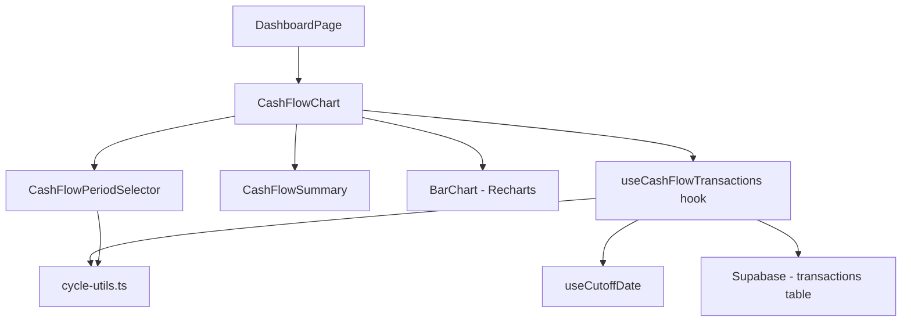

# Design Document: Cashflow Period Filter

## Overview

Fitur ini memperbaiki komponen CashFlowChart di dashboard FinTrack dengan menambahkan navigasi periode berbasis cutoff date dan memperjelas tampilan grafik. Saat ini, CashFlowChart hanya menampilkan data bulan berjalan tanpa kemampuan navigasi. Setelah perbaikan, pengguna dapat berpindah antar periode siklus anggaran dan melihat ringkasan arus kas per periode.

Pendekatan desain:
- Memanfaatkan infrastruktur yang sudah ada (`cycle-utils.ts`, `useCutoffDate` hook)
- Mengikuti pola yang sudah diterapkan di `PeriodSelector` (reports) dan `BudgetProgressSection`
- Menambahkan state management periode di level komponen CashFlowChart
- Membuat hook `useCashFlowTransactions` untuk fetching data berdasarkan periode

## Architecture



Alur data:
1. `CashFlowChart` menyimpan state `selectedMonth` dan `selectedYear`
2. `useCashFlowTransactions` menerima month/year + cutoffDate, menghitung `CycleRange` via `getCycleRangeForMonth`, lalu query transaksi
3. `CashFlowPeriodSelector` menampilkan label periode dan tombol navigasi
4. `CashFlowSummary` menghitung total dari data transaksi yang sudah difilter

## Components and Interfaces

### 1. `useCashFlowTransactions` Hook

```typescript
interface UseCashFlowTransactionsParams {
  month: number;  // 0-11
  year: number;
  cutoffDate: number;
}

interface UseCashFlowTransactionsResult {
  data: Transaction[] | undefined;
  isLoading: boolean;
  error: Error | null;
  cycleRange: CycleRange;
}

function useCashFlowTransactions(params: UseCashFlowTransactionsParams): UseCashFlowTransactionsResult;
```

Hook ini menghitung `CycleRange` menggunakan `getCycleRangeForMonth` dan melakukan query ke Supabase untuk transaksi dalam rentang tersebut. Query key menggunakan `['transactions', 'cashflow', userId, cycleStart, cycleEnd]`.

### 2. `CashFlowPeriodSelector` Component

```typescript
interface CashFlowPeriodSelectorProps {
  month: number;        // 0-11
  year: number;
  cutoffDate: number;
  cycleRange: CycleRange;
  onPrevious: () => void;
  onNext: () => void;
  canGoNext: boolean;
}
```

Komponen ini menampilkan:
- Tombol navigasi kiri/kanan
- Label periode: format "25 Jan – 24 Feb" jika cutoff > 1, atau "Januari 2024" jika cutoff = 1

### 3. `CashFlowSummary` Component

```typescript
interface CashFlowSummaryProps {
  totalIncome: number;
  totalExpenses: number;
  netChange: number;
}
```

Menampilkan 3 metrik dalam satu baris: Pemasukan (hijau), Pengeluaran (merah), Selisih (hijau/merah sesuai nilai).

### 4. `CashFlowChart` (Refactored)

Komponen utama yang mengorkestrasikan semua sub-komponen:

```typescript
// Tidak lagi menerima transactions sebagai prop
// Mengelola state periode sendiri dan fetch data via hook
export default function CashFlowChart(): JSX.Element;
```

Perubahan dari desain lama:
- Menghapus prop `transactions` — komponen fetch sendiri via `useCashFlowTransactions`
- Menambahkan state `month`/`year` untuk navigasi periode
- Menambahkan `CashFlowPeriodSelector` dan `CashFlowSummary`
- Memperbaiki format label sumbu-X

### 5. Fungsi Utilitas `buildDailyData` (Refactored)

```typescript
interface DailyData {
  label: string;      // Format: "25" atau "25 Jan" (saat pergantian bulan)
  fullDate: string;   // Format: "YYYY-MM-DD" untuk tooltip
  Pemasukan: number;
  Pengeluaran: number;
}

function buildDailyData(transactions: Transaction[], cycleRange: CycleRange): DailyData[];
```

Perubahan:
- Menerima `cycleRange` untuk menentukan kapan perlu menampilkan nama bulan di label
- Menambahkan `fullDate` untuk tooltip yang lebih informatif
- Label menampilkan nama bulan pada hari pertama bulan baru dalam rentang

### 6. Fungsi Navigasi Periode

```typescript
// Menentukan apakah bisa navigasi ke periode berikutnya
function canNavigateCashFlowNext(month: number, year: number): boolean;

// Mendapatkan bulan/tahun sebelumnya
function getPreviousCashFlowPeriod(month: number, year: number): { month: number; year: number };

// Mendapatkan bulan/tahun berikutnya
function getNextCashFlowPeriod(month: number, year: number): { month: number; year: number };
```

Fungsi-fungsi ini mengikuti pola yang sama dengan `report-utils.ts` (`canNavigateNext`, `getPreviousMonth`, `getNextMonth`).

### 7. Fungsi Format Label Periode

```typescript
// Menghasilkan label periode untuk CashFlowPeriodSelector
function formatCashFlowPeriodLabel(cycleRange: CycleRange, cutoffDate: number): string;
```

- Jika cutoff = 1: mengembalikan nama bulan + tahun (contoh: "Januari 2024")
- Jika cutoff > 1: mengembalikan rentang tanggal (contoh: "25 Jan – 24 Feb")

## Data Models

Tidak ada perubahan skema database. Fitur ini hanya mengubah cara data transaksi yang sudah ada di-query dan ditampilkan.

Data yang digunakan:
- **transactions** table: field `date`, `type`, `amount`, `user_id`
- **user_profiles** table: field `cutoff_date`

Query pattern:
```sql
SELECT * FROM transactions
WHERE user_id = :userId
  AND date >= :cycleStart
  AND date < :cycleEnd
ORDER BY date ASC
```


## Correctness Properties

*A property is a characteristic or behavior that should hold true across all valid executions of a system — essentially, a formal statement about what the system should do. Properties serve as the bridge between human-readable specifications and machine-verifiable correctness guarantees.*

### Property 1: Navigasi periode round-trip

*For any* bulan dan tahun yang valid, navigasi ke periode sebelumnya lalu ke periode berikutnya harus mengembalikan ke bulan dan tahun awal yang sama.

**Validates: Requirements 1.3, 1.4**

### Property 2: Constraint navigasi ke depan

*For any* bulan dan tahun, `canNavigateCashFlowNext` harus mengembalikan `false` jika dan hanya jika bulan/tahun tersebut merepresentasikan periode berjalan atau masa depan relatif terhadap tanggal hari ini.

**Validates: Requirements 1.5**

### Property 3: Format label periode

*For any* `CycleRange` dan `cutoffDate`, fungsi `formatCashFlowPeriodLabel` harus:
- Mengembalikan string yang mengandung nama bulan lengkap jika cutoffDate = 1
- Mengembalikan string yang mengandung tanggal start dan tanggal (end - 1 hari) jika cutoffDate > 1
- Untuk rentang yang melewati batas bulan, label harus mengandung nama kedua bulan

**Validates: Requirements 1.6, 1.7, 4.1, 4.2**

### Property 4: Kebenaran filter transaksi

*For any* daftar transaksi dan `CycleRange` yang valid, hasil `buildDailyData(transactions, cycleRange)` hanya boleh mengandung data dari transaksi yang memiliki `date >= cycleRange.start` dan `date < cycleRange.end`, dan semua transaksi dalam rentang tersebut harus tercakup (tidak ada yang hilang).

**Validates: Requirements 2.1, 2.4**

### Property 5: Kebenaran perhitungan ringkasan

*For any* daftar transaksi, `calculateCashFlowSummary(transactions)` harus menghasilkan:
- `totalIncome` = jumlah amount dari semua transaksi bertipe 'income'
- `totalExpenses` = jumlah amount dari semua transaksi bertipe 'expense'
- `netChange` = `totalIncome - totalExpenses`
- Transaksi bertipe 'transfer' tidak boleh mempengaruhi perhitungan

**Validates: Requirements 3.1**

## Error Handling

| Skenario | Penanganan |
|----------|-----------|
| Gagal fetch transaksi | Tampilkan pesan error dengan tombol retry, gunakan pola `ErrorState` yang sudah ada |
| `cutoffDate` belum tersedia (loading) | Tampilkan skeleton loader, jangan render chart |
| Tidak ada transaksi dalam periode | Tampilkan empty state dengan informasi rentang periode |
| `cutoffDate` bernilai invalid | Fallback ke nilai default 1 (bulan kalender standar) |

## Testing Strategy

### Property-Based Testing

Library: **fast-check** (sudah tersedia di ekosistem TypeScript/Vitest)

Konfigurasi: minimum 100 iterasi per property test.

Setiap property test harus di-tag dengan komentar:
```
// Feature: cashflow-period-filter, Property N: [judul property]
```

Property tests yang akan diimplementasi:
1. **Property 1**: Generate random month/year, verify `getPrevious → getNext` = identity
2. **Property 2**: Generate random dates, verify `canNavigateCashFlowNext` constraint
3. **Property 3**: Generate random cutoffDate (1-28) dan CycleRange, verify label format
4. **Property 4**: Generate random transactions dan CycleRange, verify filter completeness dan correctness
5. **Property 5**: Generate random transaction lists, verify summary arithmetic

### Unit Testing

Unit tests (Vitest + React Testing Library) untuk:
- Rendering `CashFlowPeriodSelector` dengan berbagai state
- Rendering `CashFlowSummary` dengan nilai positif/negatif (warna indikator)
- Empty state message mengandung rentang periode
- `buildDailyData` dengan data cross-month
- Integrasi `CashFlowChart` dengan mock hook data

### Pendekatan Dual Testing

- **Property tests**: Memvalidasi kebenaran universal (filtering, kalkulasi, navigasi)
- **Unit tests**: Memvalidasi contoh spesifik, edge cases, dan rendering UI
- Keduanya saling melengkapi untuk coverage yang komprehensif
