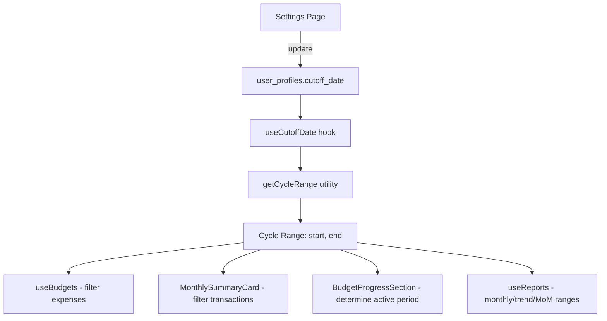

# Design Document: Custom Cutoff Date (Tanggal Gajian)

## Overview

Fitur ini memungkinkan setiap pengguna mengatur tanggal cutoff (tanggal gajian) sehingga siklus anggaran, ringkasan bulanan, dan laporan mengikuti periode gaji, bukan bulan kalender standar 1-31. Perubahan meliputi: (1) kolom baru `cutoff_date` di tabel `user_profiles`, (2) fungsi utilitas terpusat `getCycleRange` untuk menghitung rentang siklus, (3) hook `useCutoffDate` untuk mengakses preferensi, (4) UI pengaturan di Settings, dan (5) update pada semua komponen yang saat ini mengasumsikan batas bulan kalender.

## Architecture

### Pendekatan Umum

Perubahan mengikuti arsitektur FinTrack yang sudah ada (Next.js App Router + React hooks + Supabase). Satu file utilitas baru (`src/lib/cycle-utils.ts`) menjadi sumber kebenaran tunggal untuk perhitungan siklus. Satu hook baru (`useCutoffDate`) menyediakan akses ke preferensi pengguna. Komponen-komponen yang terpengaruh mengimpor utilitas dan hook ini untuk menggantikan logika bulan kalender.

### Alur Data



### File yang Terpengaruh

| File | Perubahan |
|------|-----------|
| `supabase/migrations/00008_cutoff_date.sql` | **Baru** — migrasi tambah kolom `cutoff_date` |
| `src/lib/cycle-utils.ts` | **Baru** — utilitas `getCycleRange` dan helper |
| `src/hooks/useCutoffDate.ts` | **Baru** — hook untuk mengakses cutoff_date |
| `src/types/index.ts` | Update `UserProfile` interface |
| `src/app/(protected)/settings/page.tsx` | Tambah section pengaturan cutoff date |
| `src/hooks/useBudgets.ts` | Ganti logika bulan kalender dengan `getCycleRange` |
| `src/components/dashboard/MonthlySummaryCard.tsx` | Ganti logika bulan kalender dengan `getCycleRange` |
| `src/components/dashboard/BudgetProgressSection.tsx` | Ganti `getCurrentMonth` dengan cycle-aware logic |
| `src/hooks/useReports.ts` | Ganti `getMonthDateRange` dan `getTrendDateRange` dengan `getCycleRange` |

## Components and Interfaces

### 1. Database Migration (`supabase/migrations/00008_cutoff_date.sql`)

```sql
-- Add cutoff_date column to user_profiles
ALTER TABLE user_profiles
  ADD COLUMN cutoff_date INTEGER NOT NULL DEFAULT 1
    CHECK (cutoff_date >= 1 AND cutoff_date <= 28);
```

### 2. Cycle Utilities (`src/lib/cycle-utils.ts`)

```typescript
export interface CycleRange {
  start: string; // "YYYY-MM-DD"
  end: string;   // "YYYY-MM-DD"
}

/**
 * Menghitung rentang siklus anggaran berdasarkan cutoff date.
 *
 * Logika:
 * - Jika cutoffDate === 1: siklus = 1 bulan berjalan s/d 1 bulan berikutnya (bulan kalender standar)
 * - Jika cutoffDate > 1 dan referenceDate >= cutoffDate bulan berjalan:
 *     siklus = cutoffDate bulan berjalan s/d cutoffDate bulan berikutnya
 * - Jika cutoffDate > 1 dan referenceDate < cutoffDate bulan berjalan:
 *     siklus = cutoffDate bulan sebelumnya s/d cutoffDate bulan berjalan
 *
 * @param cutoffDate - Integer 1-28
 * @param referenceDate - Tanggal acuan (default: hari ini)
 * @returns CycleRange { start, end } dalam format "YYYY-MM-DD"
 */
export function getCycleRange(
  cutoffDate: number,
  referenceDate: Date = new Date()
): CycleRange {
  const year = referenceDate.getFullYear();
  const month = referenceDate.getMonth(); // 0-11
  const day = referenceDate.getDate();

  if (cutoffDate === 1) {
    // Bulan kalender standar
    const start = formatDate(year, month, 1);
    const nextMonth = month === 11 ? 0 : month + 1;
    const nextYear = month === 11 ? year + 1 : year;
    const end = formatDate(nextYear, nextMonth, 1);
    return { start, end };
  }

  if (day >= cutoffDate) {
    // Siklus dimulai di bulan berjalan
    const start = formatDate(year, month, cutoffDate);
    const nextMonth = month === 11 ? 0 : month + 1;
    const nextYear = month === 11 ? year + 1 : year;
    const end = formatDate(nextYear, nextMonth, cutoffDate);
    return { start, end };
  } else {
    // Siklus dimulai di bulan sebelumnya
    const prevMonth = month === 0 ? 11 : month - 1;
    const prevYear = month === 0 ? year - 1 : year;
    const start = formatDate(prevYear, prevMonth, cutoffDate);
    const end = formatDate(year, month, cutoffDate);
    return { start, end };
  }
}

/** Format tanggal ke "YYYY-MM-DD" */
function formatDate(year: number, month: number, day: number): string {
  return `${year}-${String(month + 1).padStart(2, '0')}-${String(day).padStart(2, '0')}`;
}

/**
 * Menentukan bulan anggaran (budget month) berdasarkan cycle range.
 * Budget month = tanggal 1 dari bulan di mana siklus dimulai.
 * Contoh: cycle start "2024-01-25" → budget month "2024-01-01"
 */
export function getCycleBudgetMonth(cycleRange: CycleRange): string {
  const [year, month] = cycleRange.start.split('-');
  return `${year}-${month}-01`;
}

/**
 * Menghitung cycle range untuk bulan anggaran tertentu.
 * Kebalikan dari getCycleBudgetMonth — dari budget month ke cycle range.
 *
 * @param budgetMonth - Format "YYYY-MM-01" atau "YYYY-MM"
 * @param cutoffDate - Integer 1-28
 */
export function getCycleRangeForMonth(
  budgetMonth: string,
  cutoffDate: number
): CycleRange {
  const parts = budgetMonth.split('-');
  const year = parseInt(parts[0], 10);
  const month = parseInt(parts[1], 10) - 1; // 0-indexed

  if (cutoffDate === 1) {
    const start = formatDate(year, month, 1);
    const nextMonth = month === 11 ? 0 : month + 1;
    const nextYear = month === 11 ? year + 1 : year;
    const end = formatDate(nextYear, nextMonth, 1);
    return { start, end };
  }

  const start = formatDate(year, month, cutoffDate);
  const nextMonth = month === 11 ? 0 : month + 1;
  const nextYear = month === 11 ? year + 1 : year;
  const end = formatDate(nextYear, nextMonth, cutoffDate);
  return { start, end };
}
```

### 3. useCutoffDate Hook (`src/hooks/useCutoffDate.ts`)

```typescript
'use client';

import { useQuery } from '@tanstack/react-query';
import { createClient } from '@/lib/supabase/client';
import { useAuth } from '@/providers/AuthProvider';

const DEFAULT_CUTOFF_DATE = 1;

export function useCutoffDate() {
  const { user } = useAuth();

  const query = useQuery({
    queryKey: ['user-profile', 'cutoff-date', user?.id],
    queryFn: async () => {
      const supabase = createClient();
      const { data, error } = await supabase
        .from('user_profiles')
        .select('cutoff_date')
        .eq('id', user!.id)
        .single();

      if (error) throw error;
      return data?.cutoff_date ?? DEFAULT_CUTOFF_DATE;
    },
    enabled: !!user,
  });

  return {
    cutoffDate: query.data ?? DEFAULT_CUTOFF_DATE,
    isLoading: query.isLoading,
  };
}
```

### 4. Updated UserProfile Type

```typescript
export interface UserProfile {
  id: string;
  display_name: string | null;
  onboarding_completed: boolean;
  theme_preference: 'light' | 'dark' | 'system';
  large_transaction_threshold: number;
  cutoff_date: number; // 1-28, default 1
  created_at: string;
  updated_at: string;
}
```

### 5. Settings UI — CutoffDateSection

Mengikuti pola yang sama dengan `NotificationSettingsSection` yang sudah ada. Menggunakan `<select>` dengan opsi 1-28.

```typescript
function CutoffDateSection() {
  const { user } = useAuth();
  const { showError, showSuccess } = useToast();
  const [cutoffDate, setCutoffDate] = useState('1');
  const [loading, setLoading] = useState(false);
  const [loaded, setLoaded] = useState(false);
  const queryClient = useQueryClient();

  useEffect(() => {
    if (!user || loaded) return;
    const supabase = createClient();
    supabase
      .from('user_profiles')
      .select('cutoff_date')
      .eq('id', user.id)
      .single()
      .then(({ data }) => {
        if (data?.cutoff_date != null) {
          setCutoffDate(String(data.cutoff_date));
        }
        setLoaded(true);
      });
  }, [user, loaded]);

  const handleSave = async () => {
    if (!user) return;
    setLoading(true);
    try {
      const supabase = createClient();
      const { error } = await supabase
        .from('user_profiles')
        .update({
          cutoff_date: parseInt(cutoffDate, 10),
          updated_at: new Date().toISOString(),
        })
        .eq('id', user.id);

      if (error) throw error;
      // Invalidate cutoff date cache
      queryClient.invalidateQueries({ queryKey: ['user-profile', 'cutoff-date'] });
      showSuccess('Tanggal cutoff berhasil diperbarui.');
    } catch {
      showError('Gagal memperbarui tanggal cutoff. Silakan coba lagi.');
    } finally {
      setLoading(false);
    }
  };

  return (
    <Card title="Tanggal Cutoff / Gajian">
      <div className="space-y-3">
        <p className="text-small text-text-muted">
          Tentukan tanggal mulai siklus anggaran bulanan Anda. Misalnya, jika gajian tanggal 25,
          maka siklus anggaran Anda adalah tanggal 25 bulan ini sampai tanggal 24 bulan depan.
        </p>
        <div>
          <label htmlFor="cutoff-date" className="block text-caption text-text-secondary mb-1">
            Tanggal Cutoff
          </label>
          <select
            id="cutoff-date"
            value={cutoffDate}
            onChange={(e) => setCutoffDate(e.target.value)}
            className="w-full px-3 py-2 border border-border rounded-lg ..."
          >
            {Array.from({ length: 28 }, (_, i) => i + 1).map((d) => (
              <option key={d} value={d}>
                {d === 1 ? 'Tanggal 1 (default — bulan kalender)' : `Tanggal ${d}`}
              </option>
            ))}
          </select>
        </div>
        <Button onClick={handleSave} loading={loading} size="sm">
          Simpan
        </Button>
      </div>
    </Card>
  );
}
```

### 6. Updated useBudgets — fetchBudgetsWithSpending

Perubahan utama: mengganti logika bulan kalender dengan `getCycleRangeForMonth`.

```typescript
// SEBELUM:
const monthStart = month;
const monthDate = new Date(month);
const nextMonth = new Date(monthDate.getFullYear(), monthDate.getMonth() + 1, 1);
const monthEnd = nextMonth.toISOString().split('T')[0];

// SESUDAH:
import { getCycleRangeForMonth } from '@/lib/cycle-utils';

async function fetchBudgetsWithSpending(
  userId: string,
  month: string,
  cutoffDate: number
): Promise<BudgetWithSpending[]> {
  // ...fetch budgets sama seperti sebelumnya...

  const { start: monthStart, end: monthEnd } = getCycleRangeForMonth(month, cutoffDate);

  // ...fetch expenses dengan monthStart dan monthEnd...
}
```

Hook `useBudgets` menerima `cutoffDate` sebagai parameter tambahan:

```typescript
export function useBudgets(month: string, cutoffDate: number = 1) {
  const { user } = useAuth();
  return useQuery({
    queryKey: budgetKeys.list(user?.id ?? '', month, cutoffDate),
    queryFn: () => fetchBudgetsWithSpending(user!.id, month, cutoffDate),
    enabled: !!user && !!month,
  });
}
```

### 7. Updated MonthlySummaryCard

Mengganti logika bulan kalender dengan `getCycleRange`:

```typescript
function useCurrentCycleTransactions() {
  const { user } = useAuth();
  const { cutoffDate } = useCutoffDate();
  const { start: cycleStart, end: cycleEnd } = getCycleRange(cutoffDate);

  return useQuery({
    queryKey: ['transactions', 'monthly', user?.id, cycleStart, cycleEnd],
    queryFn: async () => {
      const supabase = createClient();
      const { data, error } = await supabase
        .from('transactions')
        .select('*')
        .eq('user_id', user!.id)
        .gte('date', cycleStart)
        .lt('date', cycleEnd)
        .order('date', { ascending: true });

      if (error) throw error;
      return (data as Transaction[]) ?? [];
    },
    enabled: !!user && !isNaN(cutoffDate),
  });
}
```

### 8. Updated BudgetProgressSection

Mengganti `getCurrentMonth()` dengan cycle-aware logic:

```typescript
export default function BudgetProgressSection() {
  const { cutoffDate } = useCutoffDate();
  const cycleRange = getCycleRange(cutoffDate);
  const budgetMonth = getCycleBudgetMonth(cycleRange);
  const { data: budgets, isLoading } = useBudgets(budgetMonth, cutoffDate);
  // ...rest sama...
}
```

### 9. Updated useReports — getMonthDateRange

Mengganti `getMonthDateRange` dan `getTrendDateRange` dengan versi cycle-aware:

```typescript
// SEBELUM:
function getMonthDateRange(month: number, year: number) {
  const start = `${year}-${String(month + 1).padStart(2, '0')}-01`;
  // ...
}

// SESUDAH:
function getMonthDateRange(month: number, year: number, cutoffDate: number) {
  const budgetMonth = `${year}-${String(month + 1).padStart(2, '0')}`;
  return getCycleRangeForMonth(budgetMonth, cutoffDate);
}
```

Hook `useReports` menerima `cutoffDate` sebagai parameter tambahan:

```typescript
export interface UseReportsParams {
  month: number;
  year: number;
  view: ReportView;
  cutoffDate?: number; // default 1
}
```

## Data Models

### Perubahan Database

Satu kolom baru ditambahkan ke tabel `user_profiles`:

| Kolom | Tipe | Default | Constraint | Keterangan |
|-------|------|---------|------------|------------|
| `cutoff_date` | INTEGER | 1 | CHECK (1-28) | Tanggal mulai siklus anggaran |

### Tidak Ada Perubahan Pada

- Tabel `budgets` — field `month` tetap DATE, diinterpretasikan sebagai bulan di mana siklus dimulai
- Tabel `transactions` — tidak ada perubahan
- Tabel `accounts` — tidak ada perubahan
- Tabel `categories` — tidak ada perubahan

### Mapping Siklus

| Cutoff Date | Budget Month "2024-01-01" | Cycle Range |
|-------------|--------------------------|-------------|
| 1 (default) | 2024-01-01 | 2024-01-01 s/d 2024-02-01 |
| 25 | 2024-01-01 | 2024-01-25 s/d 2024-02-25 |
| 10 | 2024-01-01 | 2024-01-10 s/d 2024-02-10 |


## Correctness Properties

*Correctness property adalah karakteristik atau perilaku yang harus berlaku di semua eksekusi valid dari sebuah sistem — pada dasarnya, pernyataan formal tentang apa yang seharusnya dilakukan sistem. Property berfungsi sebagai jembatan antara spesifikasi yang dapat dibaca manusia dan jaminan kebenaran yang dapat diverifikasi mesin.*

### Property 1: Output Validity — getCycleRange menghasilkan tanggal valid

*For any* integer `cutoffDate` dalam rentang 1-28 dan *for any* `referenceDate` yang valid, `getCycleRange(cutoffDate, referenceDate)` SHALL mengembalikan objek `{ start, end }` di mana kedua string cocok dengan format `YYYY-MM-DD` dan keduanya merepresentasikan tanggal kalender yang valid (dapat di-parse menjadi Date tanpa error).

**Validates: Requirements 3.1, 3.6**

### Property 2: Invariant start < end

*For any* integer `cutoffDate` dalam rentang 1-28 dan *for any* `referenceDate` yang valid, `getCycleRange(cutoffDate, referenceDate)` SHALL menghasilkan `start` yang secara kronologis lebih awal dari `end`.

**Validates: Requirements 3.5**

### Property 3: Cycle Start Date Correctness

*For any* integer `cutoffDate` dalam rentang 2-28 dan *for any* `referenceDate` yang valid, tanggal `start` dari `getCycleRange(cutoffDate, referenceDate)` SHALL memiliki day-of-month yang sama dengan `cutoffDate`. Jika `referenceDate.getDate() >= cutoffDate`, maka `start` berada di bulan yang sama dengan `referenceDate`. Jika `referenceDate.getDate() < cutoffDate`, maka `start` berada di bulan sebelum `referenceDate`.

**Validates: Requirements 3.3, 3.4**

### Property 4: Backward Compatibility — cutoff=1 sama dengan bulan kalender

*For any* `referenceDate` yang valid, `getCycleRange(1, referenceDate)` SHALL menghasilkan `start` = tanggal 1 bulan berjalan dan `end` = tanggal 1 bulan berikutnya, identik dengan logika bulan kalender standar.

**Validates: Requirements 3.2, 5.2, 6.2, 7.2, 8.4, 9.1**

### Property 5: Round-trip — Budget Month ↔ Cycle Range

*For any* budget month string yang valid (format "YYYY-MM-01") dan *for any* integer `cutoffDate` dalam rentang 1-28, `getCycleBudgetMonth(getCycleRangeForMonth(budgetMonth, cutoffDate))` SHALL mengembalikan string yang sama dengan `budgetMonth`.

**Validates: Requirements 9.2**

### Property 6: Cutoff Date Range Validation

*For any* integer di luar rentang 1-28, database constraint SHALL menolak penyimpanan nilai tersebut ke field `cutoff_date` di `user_profiles`.

**Validates: Requirements 1.2**

## Error Handling

### Nilai Cutoff Date Tidak Valid

- Database CHECK constraint memastikan `cutoff_date` selalu dalam rentang 1-28
- Frontend `<select>` hanya menyediakan opsi 1-28, mencegah input tidak valid dari UI
- `useCutoffDate` hook mengembalikan default 1 jika data null atau belum dimuat

### Gagal Menyimpan Cutoff Date

- Jika update ke `user_profiles` gagal, tampilkan toast error "Gagal memperbarui tanggal cutoff. Silakan coba lagi."
- Nilai di UI dikembalikan ke nilai sebelumnya (state lokal tidak di-commit sampai save berhasil)

### Gagal Memuat Cutoff Date

- `useCutoffDate` mengembalikan default 1 saat loading atau error
- Ini memastikan semua komponen tetap berfungsi dengan perilaku bulan kalender standar sebagai fallback
- Tidak ada blocking UI — komponen merender dengan default, lalu re-render saat data tersedia

### Backward Compatibility

- Semua pengguna existing otomatis mendapat `cutoff_date = 1` dari default kolom
- Dengan cutoff=1, semua perhitungan identik dengan logika sebelumnya — zero behavioral change
- Tidak ada migrasi data yang diperlukan

## Testing Strategy

### Property-Based Tests (menggunakan fast-check)

Setiap correctness property diimplementasikan sebagai property-based test dengan minimum 100 iterasi menggunakan library `fast-check`. Test ditempatkan di `src/lib/__tests__/cycle-utils.test.ts`.

Tag format: **Feature: custom-cutoff-date, Property {number}: {property_text}**

Property tests fokus pada fungsi pure di `cycle-utils.ts`:
- `getCycleRange` — Property 1, 2, 3, 4
- `getCycleBudgetMonth` + `getCycleRangeForMonth` — Property 5

### Generator untuk Property Tests

```typescript
import fc from 'fast-check';

// Cutoff date: 1-28
const cutoffDateArb = fc.integer({ min: 1, max: 28 });

// Cutoff date > 1 (untuk Property 3)
const cutoffDateGt1Arb = fc.integer({ min: 2, max: 28 });

// Reference date: tanggal valid antara 2020-2030
const referenceDateArb = fc.date({
  min: new Date(2020, 0, 1),
  max: new Date(2030, 11, 31),
});

// Budget month: "YYYY-MM-01" format
const budgetMonthArb = fc
  .record({
    year: fc.integer({ min: 2020, max: 2030 }),
    month: fc.integer({ min: 1, max: 12 }),
  })
  .map(({ year, month }) =>
    `${year}-${String(month).padStart(2, '0')}-01`
  );
```

### Unit Tests (example-based)

Unit tests ditempatkan di file yang sama dan fokus pada:

- **cycle-utils**: Contoh spesifik untuk setiap cabang logika:
  - cutoff=1, referenceDate=15 Jan → cycle 1 Jan - 1 Feb
  - cutoff=25, referenceDate=30 Jan → cycle 25 Jan - 25 Feb
  - cutoff=25, referenceDate=10 Jan → cycle 25 Des - 25 Jan
  - cutoff=25, referenceDate=25 Jan (tepat di cutoff) → cycle 25 Jan - 25 Feb
  - Pergantian tahun: cutoff=25, referenceDate=10 Jan 2024 → cycle 25 Des 2023 - 25 Jan 2024
  - getCycleRangeForMonth: "2024-01-01" + cutoff=25 → 25 Jan - 25 Feb
  - getCycleBudgetMonth: { start: "2024-01-25" } → "2024-01-01"

- **useCutoffDate**: Mock Supabase, test loading state, default value, dan data fetch
- **CutoffDateSection**: Render test, save success/error, select options 1-28
- **Integration**: Verifikasi useBudgets, MonthlySummaryCard, BudgetProgressSection, useReports menggunakan cutoff date dari hook

### Test Dependencies

- `fast-check` — sudah digunakan di project (dari spec account-separation)
- `@testing-library/react` — sudah terinstal
- `vitest` — sudah terinstal sebagai test runner
