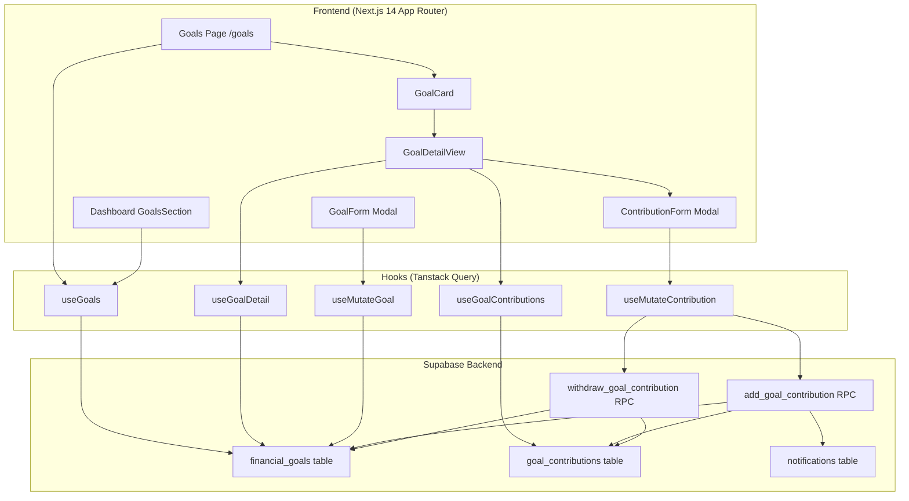

# Dokumen Desain — Financial Goals

## Overview

Fitur Financial Goals menambahkan kemampuan bagi User untuk membuat, mengelola, dan melacak tujuan keuangan di FinTrack. Berbeda dari fitur tabungan/dana darurat yang sudah ada (yang merupakan tipe akun dengan `target_amount` sederhana), Financial Goals adalah entitas terpisah yang lebih fleksibel — mendukung berbagai kategori goal, pelacakan kontribusi manual, deadline, milestone notifications, dan estimasi pencapaian.

Fitur ini terdiri dari:
- Tabel database baru (`financial_goals`, `goal_contributions`) dengan RLS
- RPC function untuk operasi kontribusi/penarikan atomik
- Halaman `/goals` dengan daftar, filter, dan detail goal
- Komponen Goal_Card, Goal_Form, Goal_Detail_View
- Section ringkasan goals di Dashboard
- Milestone notifications (25%, 50%, 75%, 100%) menggunakan sistem notifikasi yang sudah ada
- Estimasi waktu pencapaian berdasarkan rata-rata kontribusi bulanan

### Keputusan Desain Utama

1. **Entitas terpisah dari Account**: Financial Goals tidak menggunakan tabel `accounts` yang sudah ada. Ini memberikan fleksibilitas untuk multiple goals tanpa membuat akun baru per goal.
2. **Kontribusi manual**: Goal_Contribution dicatat secara manual oleh User, bukan otomatis dari transaksi. Ini menjaga kesederhanaan dan menghindari kompleksitas linking transaksi ke goals.
3. **RPC function untuk atomicity**: Operasi kontribusi dan penarikan menggunakan RPC function PostgreSQL untuk memastikan `current_amount` selalu konsisten dengan total kontribusi, mengikuti pola yang sudah ada di `create_transaction`.
4. **Reuse sistem notifikasi**: Milestone notifications menggunakan `createNotificationIfNotExists` yang sudah ada dengan tipe notifikasi baru `goal_milestone` dan deduplication key per milestone per goal.

## Architecture



### Alur Data

1. **Pembuatan Goal**: GoalForm → `useMutateGoal.create` → Supabase insert ke `financial_goals`
2. **Kontribusi**: ContributionForm → `useMutateContribution.add` → RPC `add_goal_contribution` → atomik update `current_amount` + insert `goal_contributions` + cek milestone notifications
3. **Penarikan**: ContributionForm → `useMutateContribution.withdraw` → RPC `withdraw_goal_contribution` → atomik update `current_amount` + insert `goal_contributions` (negatif) + cek status revert
4. **Dashboard**: `useGoals` fetch top 3 active goals by progress → render `GoalsProgressSection`

## Components and Interfaces

### Halaman & Route

| Route | Komponen | Deskripsi |
|-------|----------|-----------|
| `/goals` | `GoalsPage` | Halaman utama daftar semua Financial Goals |
| `/goals` (detail) | `GoalDetailView` | Tampilan detail goal (inline expand atau modal) |

### Komponen UI

#### GoalCard
- Menampilkan ringkasan satu Financial Goal: nama, kategori icon, progress bar, current_amount/target_amount, persentase, sisa hari
- Status visual: active (normal), completed (ikon centang + warna success), cancelled (dimmed)
- Tombol aksi: Edit, Hapus, Batalkan

#### GoalForm (Modal)
- Form untuk membuat/edit Financial Goal
- Fields: nama (required), kategori (select), target_amount (required, > 0), target_date (opsional, date picker), catatan (opsional, textarea)
- Validasi client-side: nama tidak kosong, target_amount > 0, target_date di masa depan (jika diisi)
- Reuse komponen `Modal` yang sudah ada

#### GoalDetailView
- Tampilan detail satu goal: semua info dari GoalCard + riwayat kontribusi + estimasi pencapaian
- Tombol: "Tambah Kontribusi", "Tarik Dana", "Batalkan Goal"
- Riwayat kontribusi: list dengan jumlah (positif/negatif), catatan, tanggal
- Estimasi: tanggal pencapaian berdasarkan rata-rata kontribusi bulanan

#### ContributionForm (Modal)
- Form untuk menambah kontribusi atau menarik dana
- Mode: "add" (kontribusi) atau "withdraw" (penarikan)
- Fields: jumlah (required, > 0), catatan (opsional)
- Validasi withdraw: jumlah ≤ current_amount

#### GoalsProgressSection (Dashboard)
- Section di Dashboard menampilkan max 3 active goals dengan progres tertinggi
- Setiap goal: nama, mini progress bar, persentase
- Link "Lihat Semua" jika > 3 active goals
- Tersembunyi jika tidak ada active goals

### Navigasi

Menambahkan item "Goals" ke `navItems` di Sidebar dan BottomNav:
```typescript
{ label: 'Goals', href: '/goals', icon: GoalIcon }
```

### Interfaces TypeScript

```typescript
// Tipe baru di src/types/index.ts

export type GoalCategory = 'tabungan' | 'dana_darurat' | 'liburan' | 'pendidikan' | 'pelunasan_hutang' | 'lainnya';

export type GoalStatus = 'active' | 'completed' | 'cancelled';

export interface FinancialGoal {
  id: string;
  user_id: string;
  name: string;
  category: GoalCategory;
  target_amount: number;
  current_amount: number;
  target_date: string | null;
  note: string | null;
  status: GoalStatus;
  created_at: string;
  updated_at: string;
}

export interface GoalContribution {
  id: string;
  goal_id: string;
  user_id: string;
  amount: number; // positif = kontribusi, negatif = penarikan
  note: string | null;
  created_at: string;
}

export interface GoalFormInput {
  name: string;
  category: GoalCategory;
  target_amount: number;
  target_date?: string;
  note?: string;
}

export interface ContributionFormInput {
  amount: number;
  note?: string;
}

// Extend NotificationType
export type NotificationType = 'budget_alert' | 'cc_reminder' | 'large_transaction' | 'goal_milestone';
```

### Hook Interfaces

```typescript
// src/hooks/useGoals.ts
export const goalKeys = {
  all: ['goals'] as const,
  list: (userId: string, status?: GoalStatus) => [...goalKeys.all, 'list', userId, status] as const,
  detail: (goalId: string) => [...goalKeys.all, 'detail', goalId] as const,
  contributions: (goalId: string) => [...goalKeys.all, 'contributions', goalId] as const,
  dashboard: (userId: string) => [...goalKeys.all, 'dashboard', userId] as const,
};

export function useGoals(status?: GoalStatus): UseQueryResult<FinancialGoal[]>;
export function useGoalDetail(goalId: string): UseQueryResult<FinancialGoal>;
export function useGoalContributions(goalId: string): UseQueryResult<GoalContribution[]>;
export function useDashboardGoals(): UseQueryResult<FinancialGoal[]>;
export function useCreateGoal(): UseMutationResult;
export function useUpdateGoal(): UseMutationResult;
export function useDeleteGoal(): UseMutationResult;
export function useCancelGoal(): UseMutationResult;
export function useAddContribution(): UseMutationResult;
export function useWithdrawContribution(): UseMutationResult;
```

## Data Models

### Tabel: `financial_goals`

| Kolom | Tipe | Constraint | Deskripsi |
|-------|------|------------|-----------|
| `id` | UUID | PK, DEFAULT gen_random_uuid() | ID unik |
| `user_id` | UUID | FK → auth.users(id), NOT NULL | Pemilik goal |
| `name` | TEXT | NOT NULL | Nama goal |
| `category` | TEXT | NOT NULL, CHECK IN (...) | Kategori goal |
| `target_amount` | BIGINT | NOT NULL, CHECK > 0 | Target nominal |
| `current_amount` | BIGINT | NOT NULL, DEFAULT 0 | Jumlah terkumpul |
| `target_date` | DATE | nullable | Tenggat waktu opsional |
| `note` | TEXT | nullable | Catatan opsional |
| `status` | TEXT | NOT NULL, DEFAULT 'active', CHECK IN ('active','completed','cancelled') | Status goal |
| `created_at` | TIMESTAMPTZ | NOT NULL, DEFAULT now() | Waktu pembuatan |
| `updated_at` | TIMESTAMPTZ | NOT NULL, DEFAULT now() | Waktu update terakhir |

### Tabel: `goal_contributions`

| Kolom | Tipe | Constraint | Deskripsi |
|-------|------|------------|-----------|
| `id` | UUID | PK, DEFAULT gen_random_uuid() | ID unik |
| `goal_id` | UUID | FK → financial_goals(id) ON DELETE CASCADE, NOT NULL | Goal terkait |
| `user_id` | UUID | FK → auth.users(id), NOT NULL | Pemilik (untuk RLS) |
| `amount` | BIGINT | NOT NULL, CHECK ≠ 0 | Jumlah (positif = kontribusi, negatif = penarikan) |
| `note` | TEXT | nullable | Catatan opsional |
| `created_at` | TIMESTAMPTZ | NOT NULL, DEFAULT now() | Waktu pencatatan |

### Indexes

```sql
CREATE INDEX idx_financial_goals_user_status ON financial_goals(user_id, status);
CREATE INDEX idx_financial_goals_user_created ON financial_goals(user_id, created_at DESC);
CREATE INDEX idx_goal_contributions_goal ON goal_contributions(goal_id, created_at DESC);
CREATE INDEX idx_goal_contributions_user ON goal_contributions(user_id);
```

### Row Level Security

```sql
-- financial_goals
ALTER TABLE financial_goals ENABLE ROW LEVEL SECURITY;
CREATE POLICY "Users can only access own goals"
  ON financial_goals FOR ALL
  USING (auth.uid() = user_id)
  WITH CHECK (auth.uid() = user_id);

-- goal_contributions
ALTER TABLE goal_contributions ENABLE ROW LEVEL SECURITY;
CREATE POLICY "Users can only access own contributions"
  ON goal_contributions FOR ALL
  USING (auth.uid() = user_id)
  WITH CHECK (auth.uid() = user_id);
```

### RPC Functions

#### `add_goal_contribution`

```sql
CREATE OR REPLACE FUNCTION add_goal_contribution(
  p_user_id UUID,
  p_goal_id UUID,
  p_amount BIGINT,
  p_note TEXT DEFAULT NULL
) RETURNS goal_contributions
```

Logika:
1. Validasi `p_amount > 0`
2. Validasi goal milik user dan status = 'active'
3. Insert ke `goal_contributions`
4. Update `financial_goals.current_amount += p_amount`
5. Jika `current_amount >= target_amount`, set `status = 'completed'`
6. Cek milestone notifications (25%, 50%, 75%, 100%)
7. Return contribution row

#### `withdraw_goal_contribution`

```sql
CREATE OR REPLACE FUNCTION withdraw_goal_contribution(
  p_user_id UUID,
  p_goal_id UUID,
  p_amount BIGINT,
  p_note TEXT DEFAULT NULL
) RETURNS goal_contributions
```

Logika:
1. Validasi `p_amount > 0` dan `p_amount <= current_amount`
2. Validasi goal milik user dan status IN ('active', 'completed')
3. Insert ke `goal_contributions` dengan `amount = -p_amount`
4. Update `financial_goals.current_amount -= p_amount`
5. Jika status = 'completed' dan `current_amount < target_amount`, set `status = 'active'`
6. Return contribution row

### Milestone Notification Logic (dalam RPC)

```sql
-- Setelah update current_amount di add_goal_contribution:
v_progress := (v_new_amount * 100) / v_target_amount;
v_old_progress := (v_old_amount * 100) / v_target_amount;

-- Cek setiap milestone
FOREACH v_milestone IN ARRAY ARRAY[25, 50, 75, 100] LOOP
  IF v_progress >= v_milestone AND v_old_progress < v_milestone THEN
    INSERT INTO notifications (user_id, type, message, deduplication_key)
    VALUES (
      p_user_id,
      'goal_milestone',
      CASE v_milestone
        WHEN 100 THEN 'Selamat! Goal "' || v_goal_name || '" telah tercapai! 🎉'
        ELSE 'Goal "' || v_goal_name || '" sudah mencapai ' || v_milestone || '%!'
      END,
      'goal_milestone:' || p_goal_id || ':' || v_milestone
    );
  END IF;
END LOOP;
```

### Estimasi Pencapaian (Client-side)

```typescript
function calculateEstimatedDate(goal: FinancialGoal, contributions: GoalContribution[]): Date | null {
  const positiveContributions = contributions.filter(c => c.amount > 0);
  if (positiveContributions.length < 2) return null;

  // Hitung rata-rata kontribusi per bulan
  const firstDate = new Date(positiveContributions[positiveContributions.length - 1].created_at);
  const lastDate = new Date(positiveContributions[0].created_at);
  const monthsDiff = Math.max(1,
    (lastDate.getFullYear() - firstDate.getFullYear()) * 12 +
    (lastDate.getMonth() - firstDate.getMonth())
  );

  const totalPositive = positiveContributions.reduce((sum, c) => sum + c.amount, 0);
  const avgMonthly = totalPositive / monthsDiff;

  if (avgMonthly <= 0) return null;

  const remaining = goal.target_amount - goal.current_amount;
  const monthsNeeded = Math.ceil(remaining / avgMonthly);

  const estimated = new Date();
  estimated.setMonth(estimated.getMonth() + monthsNeeded);
  return estimated;
}
```


## Correctness Properties

*A property is a characteristic or behavior that should hold true across all valid executions of a system — essentially, a formal statement about what the system should do. Properties serve as the bridge between human-readable specifications and machine-verifiable correctness guarantees.*

### Property 1: Inisialisasi Goal Baru

*For any* valid GoalFormInput (nama non-kosong, target_amount > 0, target_date opsional di masa depan), Financial Goal yang dibuat harus selalu memiliki `status = 'active'` dan `current_amount = 0`.

**Validates: Requirements 1.3**

### Property 2: Validasi Goal Form Menolak Input Invalid

*For any* GoalFormInput dengan nama kosong (termasuk string whitespace-only) atau target_amount ≤ 0, validasi harus menolak input tersebut dan tidak membuat Financial Goal baru.

**Validates: Requirements 1.4**

### Property 3: Validasi Jumlah Kontribusi dan Penarikan

*For any* jumlah kontribusi ≤ 0, operasi harus ditolak. *For any* jumlah penarikan ≤ 0 atau melebihi current_amount pada Financial Goal, operasi harus ditolak.

**Validates: Requirements 3.2, 4.2**

### Property 4: Konsistensi current_amount dengan Total Kontribusi

*For any* Financial Goal dan *for any* urutan operasi kontribusi dan penarikan yang valid, `current_amount` pada Financial Goal harus selalu sama dengan jumlah total (SUM) dari semua `goal_contributions.amount` yang terkait.

**Validates: Requirements 3.3, 4.3, 10.4**

### Property 5: Konsistensi Status dengan Progress

*For any* Financial Goal dengan status 'active', jika setelah kontribusi `current_amount >= target_amount`, maka status harus berubah menjadi 'completed'. *For any* Financial Goal dengan status 'completed', jika setelah penarikan `current_amount < target_amount`, maka status harus kembali menjadi 'active'.

**Validates: Requirements 3.4, 4.4**

### Property 6: Kalkulasi Progress

*For any* Financial Goal dengan `target_amount > 0`, progress percentage harus sama dengan `Math.round((current_amount / target_amount) * 100)`, dan remaining amount harus sama dengan `Math.max(0, target_amount - current_amount)`.

**Validates: Requirements 5.1, 5.4, 5.6**

### Property 7: Filter Goals Berdasarkan Status

*For any* kumpulan Financial Goals dengan berbagai status dan *for any* filter status yang dipilih, hasil filter harus hanya berisi goals dengan status yang sesuai, dan jumlah hasil harus sama dengan jumlah goals yang memiliki status tersebut.

**Validates: Requirements 6.3**

### Property 8: Dashboard Menampilkan Top 3 Goals Berdasarkan Progress

*For any* kumpulan Financial Goals aktif, dashboard harus menampilkan tepat `min(3, jumlah_active_goals)` goals, dan goals yang ditampilkan harus merupakan goals dengan progress percentage tertinggi.

**Validates: Requirements 7.1**

### Property 9: Milestone Notifications pada Threshold yang Benar

*For any* Financial Goal dan *for any* kontribusi yang membuat progress melewati milestone (25%, 50%, 75%, 100%) untuk pertama kalinya, sistem harus membuat tepat satu Notification untuk setiap milestone yang dilewati.

**Validates: Requirements 8.1, 8.2, 8.3, 8.4**

### Property 10: Deduplikasi Milestone Notifications

*For any* Financial Goal dan *for any* milestone yang sudah pernah tercapai, kontribusi berikutnya yang tidak melewati milestone baru tidak boleh membuat Notification duplikat untuk milestone yang sama.

**Validates: Requirements 8.5**

### Property 11: Estimasi Waktu Pencapaian

*For any* Financial Goal dengan minimal 2 kontribusi positif dan rata-rata kontribusi bulanan > 0, estimasi tanggal pencapaian harus dihitung sebagai `today + ceil(remaining / avg_monthly)` bulan. Jika rata-rata kontribusi bulanan ≤ 0, estimasi harus null.

**Validates: Requirements 9.1, 9.2**

## Error Handling

### Client-side Errors

| Skenario | Penanganan |
|----------|------------|
| Nama goal kosong | Tampilkan pesan error inline di bawah field nama |
| Target amount ≤ 0 | Tampilkan pesan error inline di bawah field target |
| Target date di masa lalu | Tampilkan pesan "Tanggal target harus di masa depan" |
| Jumlah kontribusi ≤ 0 | Disable tombol simpan, tampilkan pesan error |
| Jumlah penarikan > current_amount | Tampilkan pesan "Jumlah penarikan melebihi saldo goal" |
| Network error saat save | Tampilkan error toast via `useToast().showError()` dengan opsi retry |

### Server-side Errors (RPC)

| Skenario | Penanganan |
|----------|------------|
| User mismatch (RLS violation) | RPC raise exception → Supabase error → toast error |
| Goal not found | RPC raise exception → toast "Goal tidak ditemukan" |
| Goal status bukan 'active' saat kontribusi | RPC raise exception → toast "Goal sudah selesai atau dibatalkan" |
| Withdrawal > current_amount | RPC raise exception → toast "Saldo goal tidak mencukupi" |
| Duplicate notification (race condition) | Ignore error code 23505 (unique violation) — sama seperti pattern di `createNotificationIfNotExists` |

### Optimistic Updates

Mengikuti pola yang sudah ada di `useCreateAccount`:
- **Create goal**: Optimistic insert ke cache, rollback on error
- **Update goal**: Optimistic update di cache, rollback on error
- **Delete goal**: Optimistic remove dari cache, rollback on error
- **Add/withdraw contribution**: Optimistic update `current_amount` dan insert contribution ke cache, rollback on error

## Testing Strategy

### Unit Tests (Example-based)

| Test | Deskripsi | Validates |
|------|-----------|-----------|
| GoalForm renders all fields | Verifikasi semua field form ada | 1.1 |
| GoalForm category options | Verifikasi 6 opsi kategori | 1.2 |
| GoalForm pre-fills on edit | Verifikasi data terisi saat edit | 2.1 |
| Delete confirmation dialog | Verifikasi dialog muncul sebelum hapus | 2.3 |
| Cancel goal changes status | Verifikasi status berubah ke "cancelled" | 2.5 |
| Contribution form renders | Verifikasi form kontribusi muncul | 3.1 |
| Contribution history sorted | Verifikasi urutan terbaru dulu | 3.5 |
| Withdrawal form renders | Verifikasi form penarikan muncul | 4.1 |
| GoalCard shows remaining days | Verifikasi sisa hari muncul jika ada target_date | 5.3 |
| GoalCard cancelled dimmed | Verifikasi tampilan dimmed untuk cancelled | 5.5 |
| GoalsPage default active filter | Verifikasi hanya active goals ditampilkan | 6.2 |
| GoalsPage empty state | Verifikasi empty state muncul | 6.4 |
| Dashboard goal info display | Verifikasi nama, progress bar, persentase | 7.2 |
| Dashboard "Lihat Semua" link | Verifikasi link muncul jika > 3 goals | 7.3 |
| Dashboard hidden when no goals | Verifikasi section tersembunyi | 7.4 |
| Estimation warning when late | Verifikasi peringatan jika estimasi > target_date | 9.3 |

### Property-Based Tests

Library: **fast-check** (sudah umum digunakan di ekosistem TypeScript/Next.js)

Setiap property test harus:
- Menjalankan minimum 100 iterasi
- Memiliki tag komentar: `Feature: financial-goals, Property {number}: {title}`
- Menggunakan generator yang sesuai untuk tipe data (arbitrary strings, positive integers, dates, dll.)

| Property | Test | Validates |
|----------|------|-----------|
| Property 1 | Generate random valid GoalFormInput → verifikasi status='active', current_amount=0 | 1.3 |
| Property 2 | Generate random invalid inputs (empty names, non-positive amounts) → verifikasi rejection | 1.4 |
| Property 3 | Generate random non-positive amounts dan amounts > current → verifikasi rejection | 3.2, 4.2 |
| Property 4 | Generate random contribution sequences → verifikasi current_amount = SUM(contributions) | 3.3, 4.3, 10.4 |
| Property 5 | Generate random goals + contributions → verifikasi status consistency | 3.4, 4.4 |
| Property 6 | Generate random current/target amounts → verifikasi progress dan remaining calculation | 5.1, 5.4, 5.6 |
| Property 7 | Generate random goals with mixed statuses + filter → verifikasi correct filtering | 6.3 |
| Property 8 | Generate random active goals → verifikasi top 3 by progress selected | 7.1 |
| Property 9 | Generate random goals + contributions crossing milestones → verifikasi notifications | 8.1-8.4 |
| Property 10 | Generate repeated contributions past same milestone → verifikasi no duplicate notifications | 8.5 |
| Property 11 | Generate random goals with ≥ 2 contributions → verifikasi estimation formula | 9.1, 9.2 |

### Integration Tests

| Test | Deskripsi |
|------|-----------|
| RLS isolation | Verifikasi user A tidak bisa akses goals user B |
| RPC add_goal_contribution | End-to-end test kontribusi via Supabase |
| RPC withdraw_goal_contribution | End-to-end test penarikan via Supabase |
| Cascade delete | Verifikasi goal_contributions terhapus saat goal dihapus |
| Navigation | Verifikasi route /goals accessible dan navigasi item ada |
