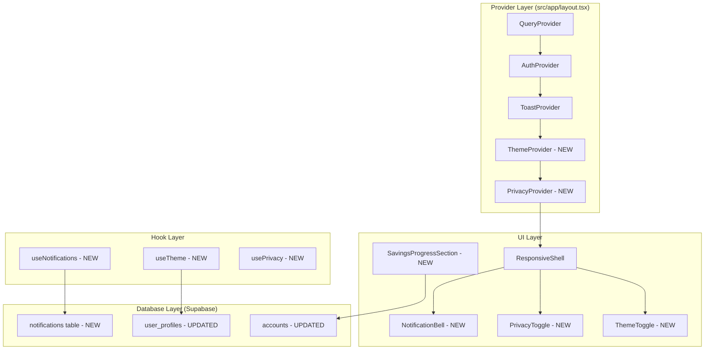

# Design Document: FinTrack Enhancements

## Overview

Dokumen ini menjelaskan desain teknis untuk empat fitur baru pada FinTrack: (1) Sistem Notifikasi & Reminder in-app untuk peringatan anggaran, jatuh tempo kartu kredit, dan transaksi besar; (2) Dark/Light Mode Toggle menggunakan CSS variables dan ThemeProvider; (3) Rekening Tabungan/Dana Darurat sebagai sub-tipe akun baru dengan pelacakan target; dan (4) Privacy Mode untuk menyembunyikan semua nilai moneter via React Context yang membungkus `formatIDR`.

Keempat fitur ini dibangun di atas arsitektur yang sudah ada (Next.js 14 App Router, Supabase, Tanstack Query, Tailwind CSS) tanpa mengubah perilaku yang sudah berjalan.

## Architecture

### High-Level Architecture



### Provider Nesting Order

```tsx
// src/app/layout.tsx
<QueryProvider>
  <AuthProvider>
    <ToastProvider>
      <ThemeProvider>
        <PrivacyProvider>
          {children}
        </PrivacyProvider>
      </ThemeProvider>
    </ToastProvider>
  </AuthProvider>
</QueryProvider>
```

ThemeProvider harus di atas PrivacyProvider karena tema mempengaruhi rendering seluruh app. PrivacyProvider hanya mempengaruhi output formatIDR.

## Components and Interfaces

### 1. Notification System

#### NotificationBell Component
Lokasi: `src/components/layout/NotificationBell.tsx`

Ditampilkan di Sidebar (desktop) dan di area header pada protected layout (mobile). Menampilkan ikon lonceng dengan badge count untuk notifikasi belum dibaca.

```typescript
interface NotificationBellProps {
  className?: string;
}
```

Saat diklik, membuka NotificationPanel sebagai dropdown overlay.

#### NotificationPanel Component
Lokasi: `src/components/notifications/NotificationPanel.tsx`

Panel dropdown yang menampilkan daftar notifikasi diurutkan dari terbaru. Setiap item menampilkan ikon tipe, pesan, dan waktu relatif.

```typescript
interface NotificationPanelProps {
  open: boolean;
  onClose: () => void;
  notifications: Notification[];
  onMarkRead: (id: string) => void;
  onMarkAllRead: () => void;
}
```

#### useNotifications Hook
Lokasi: `src/hooks/useNotifications.ts`

```typescript
// Query keys
const notificationKeys = {
  all: ['notifications'] as const,
  unread: (userId: string) => [...notificationKeys.all, 'unread', userId] as const,
  list: (userId: string) => [...notificationKeys.all, 'list', userId] as const,
};

// Hooks
function useUnreadCount(): { count: number; isLoading: boolean };
function useNotifications(): UseQueryResult<Notification[]>;
function useMarkNotificationRead(): UseMutationResult;
function useMarkAllNotificationsRead(): UseMutationResult;
```

#### Notification Generation Logic

Notifikasi dibuat di sisi client setelah transaksi berhasil disimpan. Tiga trigger:

1. **Budget Alert**: Setelah `useCreateTransaction` atau `useUpdateTransaction` sukses, evaluasi spending vs budget thresholds (75%, 90%, 100%). Cek duplikasi via query ke notifications table sebelum insert.

2. **Credit Card Reminder**: Dievaluasi saat app dibuka (di `useNotifications` hook). Hitung selisih hari antara hari ini dan due_date. Buat reminder untuk 7 hari, 3 hari, dan hari-H. Cek duplikasi per interval per siklus billing.

3. **Large Transaction Alert**: Setelah transaksi dibuat, bandingkan amount dengan `large_transaction_threshold` dari user_profiles. Jika melebihi, buat notifikasi.

```typescript
// Notification creation helper
async function createNotificationIfNotExists(
  userId: string,
  type: NotificationType,
  message: string,
  deduplicationKey: string
): Promise<void>;
```

`deduplicationKey` format:
- Budget: `budget_alert:{budget_id}:{month}:{threshold}`
- Credit card: `cc_reminder:{account_id}:{month}:{interval}`
- Large transaction: `large_tx:{transaction_id}`

### 2. Theme System

#### ThemeProvider
Lokasi: `src/providers/ThemeProvider.tsx`

```typescript
type ThemeMode = 'light' | 'dark' | 'system';

interface ThemeContextType {
  theme: ThemeMode;
  resolvedTheme: 'light' | 'dark'; // actual applied theme
  setTheme: (theme: ThemeMode) => void;
}
```

Initialization flow:
1. Baca dari `localStorage('fintrack-theme')` untuk menghindari flash
2. Jika tidak ada, default ke `'system'`
3. Jika `'system'`, gunakan `window.matchMedia('(prefers-color-scheme: dark)')` untuk resolve
4. Set class `dark` pada `<html>` element
5. Sync ke `user_profiles.theme_preference` di background (non-blocking)

#### CSS Variables Strategy

Extend `globals.css` dengan dark mode variables:

```css
:root {
  --background: #F0F4F3;
  --foreground: #1A1A1A;
  --surface: #FFFFFF;
  --surface-secondary: #F0F4F3;
  --text-primary: #1E293B;
  --text-secondary: #475569;
  --text-muted: #94A3B8;
  --border: #E2E8F0;
  --danger: #DC2626;
  /* ... existing colors as variables */
}

html.dark {
  --background: #0F172A;
  --foreground: #F1F5F9;
  --surface: #1E293B;
  --surface-secondary: #334155;
  --text-primary: #F1F5F9;
  --text-secondary: #CBD5E1;
  --text-muted: #64748B;
  --border: #334155;
  --danger: #F87171;
  /* ... dark overrides */
}
```

Update `tailwind.config.ts` untuk menggunakan CSS variables alih-alih hardcoded colors. Ini memastikan semua komponen yang sudah menggunakan design tokens (bg-surface, text-text-primary, dll.) otomatis berubah tema.

#### ThemeToggle Component
Lokasi: `src/components/ui/ThemeToggle.tsx`

Tiga-state toggle (light/dark/system) ditampilkan di Settings page dan di Sidebar/BottomNav area.

```typescript
interface ThemeToggleProps {
  className?: string;
  compact?: boolean; // true untuk Sidebar/BottomNav (icon only)
}
```

### 3. Savings & Emergency Fund Accounts

#### Database Changes

Tambah dua tipe baru ke `accounts.type` CHECK constraint dan kolom `target_amount`:

```sql
-- Migration: 00006_enhancements.sql
ALTER TABLE accounts
  DROP CONSTRAINT accounts_type_check,
  ADD CONSTRAINT accounts_type_check
    CHECK (type IN ('bank', 'e-wallet', 'cash', 'credit_card', 'investment', 'tabungan', 'dana_darurat'));

ALTER TABLE accounts ADD COLUMN target_amount BIGINT;
```

#### Updated Types

```typescript
// src/types/index.ts
export type AccountType = 'bank' | 'e-wallet' | 'cash' | 'credit_card' | 'investment' | 'tabungan' | 'dana_darurat';

export interface Account {
  // ... existing fields
  target_amount: number | null; // NEW
}
```

#### SavingsProgressBar Component
Lokasi: `src/components/accounts/SavingsProgressBar.tsx`

```typescript
interface SavingsProgressBarProps {
  balance: number;
  targetAmount: number;
}
```

Menampilkan progress bar dengan persentase (balance / target × 100%). Warna hijau saat tercapai (≥100%), primary saat dalam progres.

#### SavingsProgressSection Component (Dashboard)
Lokasi: `src/components/dashboard/SavingsProgressSection.tsx`

Menampilkan ringkasan semua akun tabungan/dana_darurat yang memiliki target. Disembunyikan jika tidak ada akun dengan target.

```typescript
interface SavingsProgressSectionProps {
  accounts: Account[];
}
```

#### AccountForm Updates

Tambah field `target_amount` yang muncul saat tipe = `tabungan` atau `dana_darurat`.

### 4. Privacy Mode

#### PrivacyProvider
Lokasi: `src/providers/PrivacyProvider.tsx`

```typescript
interface PrivacyContextType {
  privacyMode: boolean;
  togglePrivacy: () => void;
}
```

State disimpan di React state + `sessionStorage('fintrack-privacy')`. Reset saat logout (di `signOut` callback).

#### Privacy-Aware formatIDR

Alih-alih memodifikasi `formatIDR` langsung (yang merupakan pure function), buat wrapper hook:

```typescript
// src/hooks/useFormatIDR.ts
function useFormatIDR(): (amount: number) => string {
  const { privacyMode } = usePrivacy();
  return (amount: number) => privacyMode ? 'Rp •••••••' : formatIDR(amount);
}
```

Semua komponen yang menampilkan nilai moneter akan menggunakan `useFormatIDR()` alih-alih import langsung `formatIDR`. Ini memastikan privacy mode konsisten di seluruh app.

Untuk komponen yang tidak bisa menggunakan hooks (misalnya utility functions), gunakan `PrivacyContext` consumer.

#### PrivacyToggle Component
Lokasi: `src/components/ui/PrivacyToggle.tsx`

Ikon mata (terbuka/tertutup) ditampilkan di header area.

```typescript
interface PrivacyToggleProps {
  className?: string;
}
```

#### Chart Privacy

Saat privacy mode aktif, Recharts tooltip, label, dan axis values menampilkan masked values. Implementasi via custom `tickFormatter` dan `labelFormatter` yang menggunakan privacy context.

### 5. Layout Updates

#### Protected Layout Header

Tambah area header di protected layout yang menampilkan NotificationBell dan PrivacyToggle:

```tsx
// Updated src/app/(protected)/layout.tsx
function ProtectedHeader() {
  return (
    <div className="flex items-center justify-end gap-2 p-4 md:p-0 md:absolute md:top-4 md:right-4 z-30">
      <PrivacyToggle />
      <NotificationBell />
    </div>
  );
}
```

## Data Models

### New: notifications Table

```sql
CREATE TABLE notifications (
  id UUID PRIMARY KEY DEFAULT gen_random_uuid(),
  user_id UUID REFERENCES auth.users(id) NOT NULL,
  type TEXT NOT NULL CHECK (type IN ('budget_alert', 'cc_reminder', 'large_transaction')),
  message TEXT NOT NULL,
  is_read BOOLEAN NOT NULL DEFAULT false,
  deduplication_key TEXT,
  created_at TIMESTAMPTZ NOT NULL DEFAULT now()
);

CREATE UNIQUE INDEX idx_notifications_dedup
  ON notifications(user_id, deduplication_key)
  WHERE deduplication_key IS NOT NULL;

CREATE INDEX idx_notifications_user_unread
  ON notifications(user_id, is_read, created_at DESC);

-- RLS
ALTER TABLE notifications ENABLE ROW LEVEL SECURITY;

CREATE POLICY "Users can only access own notifications"
  ON notifications FOR ALL
  USING (auth.uid() = user_id)
  WITH CHECK (auth.uid() = user_id);
```

### Updated: accounts Table

```sql
-- Add new types and target_amount column
ALTER TABLE accounts
  DROP CONSTRAINT accounts_type_check,
  ADD CONSTRAINT accounts_type_check
    CHECK (type IN ('bank', 'e-wallet', 'cash', 'credit_card', 'investment', 'tabungan', 'dana_darurat'));

ALTER TABLE accounts ADD COLUMN target_amount BIGINT;
```

### Updated: user_profiles Table

```sql
ALTER TABLE user_profiles
  ADD COLUMN theme_preference TEXT NOT NULL DEFAULT 'system'
    CHECK (theme_preference IN ('light', 'dark', 'system')),
  ADD COLUMN large_transaction_threshold BIGINT NOT NULL DEFAULT 1000000;
```

### Updated TypeScript Types

```typescript
// Notification type
export type NotificationType = 'budget_alert' | 'cc_reminder' | 'large_transaction';

export interface Notification {
  id: string;
  user_id: string;
  type: NotificationType;
  message: string;
  is_read: boolean;
  deduplication_key: string | null;
  created_at: string;
}

// Updated UserProfile
export interface UserProfile {
  id: string;
  display_name: string | null;
  onboarding_completed: boolean;
  theme_preference: 'light' | 'dark' | 'system';
  large_transaction_threshold: number;
  created_at: string;
  updated_at: string;
}

// Updated AccountType
export type AccountType = 'bank' | 'e-wallet' | 'cash' | 'credit_card' | 'investment' | 'tabungan' | 'dana_darurat';

// Updated Account
export interface Account {
  // ... existing fields
  target_amount: number | null;
}
```


## Correctness Properties

*A property is a characteristic or behavior that should hold true across all valid executions of a system — essentially, a formal statement about what the system should do. Properties serve as the bridge between human-readable specifications and machine-verifiable correctness guarantees.*

### Property 1: Budget Threshold Alert Creation

*For any* budget with a limit_amount and any set of expense transactions in the budget's category and month, when the total spending crosses a threshold level (75%, 90%, or 100%), the system SHALL create a budget alert notification whose message contains the category name and the correct threshold percentage.

**Validates: Requirements 1.1, 1.2, 1.3, 1.5**

### Property 2: Notification Deduplication

*For any* notification type and deduplication key, regardless of how many times the triggering condition is evaluated, the system SHALL store at most one notification per deduplication key per user. Specifically: at most one budget alert per threshold per budget per month, and at most one credit card reminder per interval per card per billing cycle.

**Validates: Requirements 1.4, 2.4**

### Property 3: Credit Card Reminder Interval

*For any* credit card account with a due_date and any current date, the system SHALL create a credit card reminder if and only if the number of days until the next due_date equals one of the defined intervals (7, 3, or 0 days), and the reminder message SHALL contain the card name and due date.

**Validates: Requirements 2.1, 2.2, 2.3**

### Property 4: Large Transaction Alert Threshold

*For any* transaction amount and any user-defined large_transaction_threshold, the system SHALL create a large transaction alert if and only if the transaction amount strictly exceeds the threshold, and the alert message SHALL contain the transaction amount, type, and account name.

**Validates: Requirements 3.1**

### Property 5: Badge Count Equals Unread Count

*For any* set of notifications belonging to a user, the displayed badge count SHALL equal the number of notifications where is_read is false. After marking all notifications as read, the badge count SHALL be zero.

**Validates: Requirements 4.2, 4.6**

### Property 6: Notification Chronological Ordering

*For any* set of notifications displayed in the notification panel, the notifications SHALL be ordered by created_at in descending order (newest first), regardless of insertion order or notification type.

**Validates: Requirements 4.3**

### Property 7: Notification Display Completeness

*For any* notification rendered in the notification panel, the displayed output SHALL contain the notification type icon, the full message text, and a relative time string derived from created_at.

**Validates: Requirements 4.5**

### Property 8: System Theme Resolution

*For any* system color scheme preference (light or dark) as reported by `prefers-color-scheme` media query, when the user's theme_preference is set to "system", the resolved theme SHALL match the system preference exactly.

**Validates: Requirements 6.3**

### Property 9: Savings Progress Calculation

*For any* savings or emergency fund account with a target_amount > 0, the displayed progress percentage SHALL equal `(balance / target_amount) × 100`, and the displayed remaining amount SHALL equal `max(0, target_amount - balance)`.

**Validates: Requirements 9.2, 9.4**

### Property 10: Privacy Mode Masking

*For any* numeric amount, when privacy mode is active, the `useFormatIDR` hook SHALL return the string "Rp •••••••" regardless of the input amount value.

**Validates: Requirements 13.1**

### Property 11: Privacy Toggle Round-Trip

*For any* initial privacy mode state, toggling privacy mode twice SHALL return the state to its original value (off → on → off, or on → off → on).

**Validates: Requirements 12.2, 12.3**

## Error Handling

### Notification System Errors
- **Gagal membuat notifikasi**: Jika insert ke notifications table gagal, error di-log tapi tidak mengganggu flow utama (transaksi tetap berhasil). Notifikasi akan dicoba lagi pada evaluasi berikutnya.
- **Gagal memuat notifikasi**: Tampilkan badge count 0 dan pesan error di notification panel dengan tombol retry.
- **Gagal mark as read**: Tampilkan toast error dengan retry. Optimistic update di-rollback.

### Theme System Errors
- **localStorage tidak tersedia**: Fallback ke in-memory state. Tema tetap berfungsi tapi tidak persist antar tab.
- **Gagal sync ke user_profiles**: Tema tetap tersimpan di localStorage. Sync dicoba lagi pada perubahan berikutnya.
- **matchMedia tidak tersedia**: Default ke light theme.

### Savings Account Errors
- **Gagal membuat akun tabungan**: Sama dengan error handling akun yang sudah ada (toast error + retry).
- **target_amount invalid (negatif/nol)**: Validasi di form — field hanya menerima angka positif.

### Privacy Mode Errors
- **sessionStorage tidak tersedia**: Fallback ke React state saja. Privacy mode tetap berfungsi tapi tidak persist saat refresh.

## Testing Strategy

### Unit Tests (Example-Based)
- ThemeToggle renders three options (light/dark/system)
- ThemeProvider applies correct CSS class on `<html>`
- NotificationBell renders in header
- AccountForm shows target_amount field for tabungan/dana_darurat types
- SavingsProgressSection hidden when no accounts have targets
- PrivacyToggle icon changes between open/closed eye
- Privacy mode resets on logout
- Settings page shows large_transaction_threshold input with default 1.000.000
- Notification panel renders with correct layout

### Property-Based Tests (Vitest + fast-check)
- Minimum 100 iterations per property test
- Library: `fast-check` (compatible with Vitest)
- Tag format: `Feature: fintrack-enhancements, Property {number}: {title}`
- Each property test references its design document property number

Properties to implement:
1. Budget threshold alert creation logic
2. Notification deduplication invariant
3. Credit card reminder interval calculation
4. Large transaction alert threshold comparison
5. Badge count equals unread notification count
6. Notification chronological ordering
7. Notification display completeness
8. System theme resolution
9. Savings progress calculation (percentage + remaining)
10. Privacy mode masking output
11. Privacy toggle round-trip

### Integration Tests
- RLS policies on notifications table (cross-user isolation)
- Theme preference sync to user_profiles
- Notification persistence across browser sessions
- Transfer to/from savings accounts (atomic balance updates)
