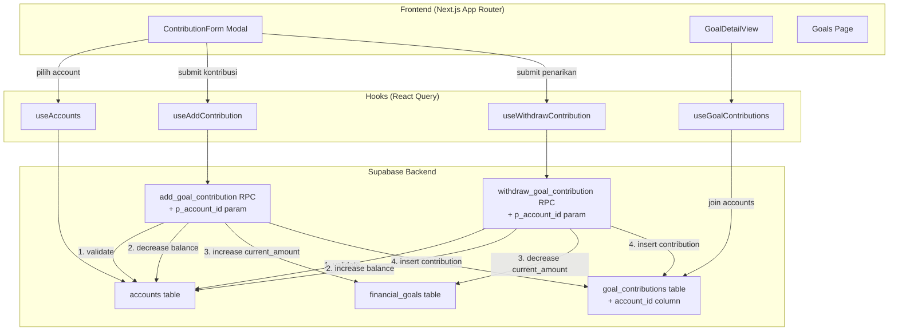

# Dokumen Desain — Goal-Account Linking

## Overview

Fitur Goal-Account Linking menghubungkan kontribusi dan penarikan Financial Goal dengan Account sumber/tujuan dana. Saat ini, kontribusi goal hanya mencatat angka tanpa mengubah saldo Account manapun. Dengan fitur ini, setiap kontribusi akan mengurangi saldo Account sumber secara atomik, dan setiap penarikan akan menambah saldo Account tujuan secara atomik.

Fitur ini merupakan **alokasi dana internal** (fund allocation), bukan pengeluaran (expense) atau pemasukan (income). Kontribusi dan penarikan goal tidak boleh muncul di daftar transaksi maupun laporan pemasukan/pengeluaran.

### Keputusan Desain Utama

1. **Kolom `account_id` nullable pada `goal_contributions`**: Untuk backward compatibility dengan kontribusi lama yang tidak memiliki account linkage. Kontribusi baru wajib menyertakan `account_id`.
2. **Modifikasi RPC functions yang sudah ada**: `add_goal_contribution` dan `withdraw_goal_contribution` akan ditambahkan parameter `p_account_id` untuk melakukan transfer saldo atomik. Parameter ini opsional di level SQL (DEFAULT NULL) agar kontribusi lama tetap valid, namun frontend akan selalu mengirimkannya.
3. **Bukan transaksi (transaction)**: Operasi ini tidak membuat row di tabel `transactions`, sehingga tidak memengaruhi laporan income/expense/cash flow.
4. **Join ke `accounts` untuk tampilan nama**: GoalDetailView akan melakukan join atau lookup terpisah untuk menampilkan nama Account pada riwayat kontribusi.
5. **Validasi saldo di RPC**: Saldo Account sumber divalidasi di level database (RPC function) untuk mencegah race condition — bukan hanya di client-side.

## Architecture



### Alur Data

1. **Kontribusi**: User buka ContributionForm → pilih Account sumber dari dropdown → isi jumlah → submit → `useAddContribution` panggil RPC `add_goal_contribution(p_user_id, p_goal_id, p_amount, p_note, p_account_id)` → RPC atomik: validasi saldo Account ≥ amount, kurangi `accounts.balance`, tambah `financial_goals.current_amount`, insert `goal_contributions` dengan `account_id` → invalidate cache goals + accounts
2. **Penarikan**: User buka ContributionForm mode withdraw → pilih Account tujuan → isi jumlah → submit → `useWithdrawContribution` panggil RPC `withdraw_goal_contribution(p_user_id, p_goal_id, p_amount, p_note, p_account_id)` → RPC atomik: tambah `accounts.balance`, kurangi `financial_goals.current_amount`, insert `goal_contributions` (negatif) dengan `account_id` → invalidate cache goals + accounts
3. **Tampilan riwayat**: `useGoalContributions` fetch `goal_contributions` dengan join ke `accounts` untuk mendapatkan nama Account → GoalDetailView render nama Account di setiap item riwayat

## Components and Interfaces

### Perubahan pada ContributionForm

ContributionForm (`src/components/goals/ContributionForm.tsx`) akan ditambahkan:

- **Props baru**: `accounts: Account[]` — daftar Account aktif untuk dropdown
- **State baru**: `accountId: string` — ID Account yang dipilih
- **UI baru**: Dropdown `<select>` "Pilih Akun Sumber" (mode add) atau "Pilih Akun Tujuan" (mode withdraw) yang menampilkan `account.name — formatIDR(account.balance)` per opsi
- **Validasi baru**:
  - Account wajib dipilih (error: "Pilih akun sumber terlebih dahulu" / "Pilih akun tujuan terlebih dahulu")
  - Mode add: jumlah ≤ saldo Account sumber (error: "Saldo akun tidak mencukupi")
- **Output**: `ContributionFormInput` diperluas dengan `account_id: string`

### Perubahan pada GoalDetailView

GoalDetailView (`src/components/goals/GoalDetailView.tsx`) akan ditambahkan:

- Fetch kontribusi dengan join ke `accounts` untuk mendapatkan nama Account
- Setiap item riwayat kontribusi menampilkan nama Account (sumber/tujuan)
- Jika Account sudah soft-deleted (`is_deleted = true`), tampilkan nama dengan indikator "(tidak aktif)"

### Perubahan pada Goals Page

Goals Page (`src/app/(protected)/goals/page.tsx`) akan:

- Fetch daftar Account aktif menggunakan `useAccounts` yang sudah ada
- Pass `accounts` ke `ContributionForm`
- Pass `accountId` ke mutation hooks `useAddContribution` dan `useWithdrawContribution`

### Perubahan pada useGoals hooks

- `useAddContribution`: Tambah parameter `accountId` ke mutation input, kirim sebagai `p_account_id` ke RPC, invalidate juga `accountKeys.all`
- `useWithdrawContribution`: Tambah parameter `accountId` ke mutation input, kirim sebagai `p_account_id` ke RPC, invalidate juga `accountKeys.all`
- `useGoalContributions`: Ubah query untuk join ke `accounts` table, return `GoalContributionWithAccount`

### TypeScript Interface Changes

```typescript
// Extend ContributionFormInput
export interface ContributionFormInput {
  amount: number;
  note?: string;
  account_id: string; // NEW — required for account linking
}

// New type for contribution with account info
export interface GoalContributionWithAccount extends GoalContribution {
  account_id: string | null; // nullable for backward compat
  account?: {
    id: string;
    name: string;
    is_deleted: boolean;
  } | null;
}
```

### Hook Interface Changes

```typescript
// useAddContribution mutation input
interface AddContributionInput {
  goalId: string;
  amount: number;
  note?: string;
  accountId: string; // NEW
}

// useWithdrawContribution mutation input
interface WithdrawContributionInput {
  goalId: string;
  amount: number;
  note?: string;
  accountId: string; // NEW
}
```

## Data Models

### Perubahan Tabel: `goal_contributions`

Tambah kolom baru:

| Kolom | Tipe | Constraint | Deskripsi |
|-------|------|------------|-----------|
| `account_id` | UUID | FK → accounts(id), NULLABLE | Account sumber (kontribusi) atau tujuan (penarikan). Nullable untuk backward compatibility dengan kontribusi lama. |

```sql
ALTER TABLE goal_contributions
  ADD COLUMN account_id UUID REFERENCES accounts(id);

CREATE INDEX idx_goal_contributions_account ON goal_contributions(account_id);
```

### Perubahan RPC: `add_goal_contribution`

Tambah parameter `p_account_id UUID DEFAULT NULL`:

```sql
CREATE OR REPLACE FUNCTION add_goal_contribution(
  p_user_id UUID,
  p_goal_id UUID,
  p_amount BIGINT,
  p_note TEXT DEFAULT NULL,
  p_account_id UUID DEFAULT NULL  -- NEW
) RETURNS goal_contributions
```

Logika tambahan (sebelum insert contribution):
1. Jika `p_account_id IS NOT NULL`:
   - Validasi Account milik `p_user_id`
   - Validasi Account aktif (`is_deleted = false`)
   - Validasi `accounts.balance >= p_amount`
   - `UPDATE accounts SET balance = balance - p_amount WHERE id = p_account_id`
2. Insert `goal_contributions` dengan `account_id = p_account_id`

### Perubahan RPC: `withdraw_goal_contribution`

Tambah parameter `p_account_id UUID DEFAULT NULL`:

```sql
CREATE OR REPLACE FUNCTION withdraw_goal_contribution(
  p_user_id UUID,
  p_goal_id UUID,
  p_amount BIGINT,
  p_note TEXT DEFAULT NULL,
  p_account_id UUID DEFAULT NULL  -- NEW
) RETURNS goal_contributions
```

Logika tambahan (sebelum insert contribution):
1. Jika `p_account_id IS NOT NULL`:
   - Validasi Account milik `p_user_id`
   - Validasi Account aktif (`is_deleted = false`)
   - `UPDATE accounts SET balance = balance + p_amount WHERE id = p_account_id`
2. Insert `goal_contributions` dengan `account_id = p_account_id`

### RLS

RLS yang sudah ada pada `goal_contributions` sudah cukup karena policy `USING (auth.uid() = user_id)` memastikan User hanya bisa akses kontribusi miliknya. Validasi tambahan bahwa `account_id` milik User yang sama dilakukan di RPC function (SECURITY DEFINER).


## Correctness Properties

*A property is a characteristic or behavior that should hold true across all valid executions of a system — essentially, a formal statement about what the system should do. Properties serve as the bridge between human-readable specifications and machine-verifiable correctness guarantees.*

### Property 1: Dropdown Hanya Menampilkan Account Aktif

*For any* kumpulan Account milik User dengan berbagai status `is_deleted`, dan *for any* mode (add atau withdraw), dropdown pemilihan Account pada ContributionForm harus hanya menampilkan Account dengan `is_deleted = false`, dan jumlah opsi harus sama dengan jumlah Account aktif.

**Validates: Requirements 1.1, 3.1**

### Property 2: Dropdown Menampilkan Nama dan Saldo Account

*For any* Account aktif yang ditampilkan di dropdown ContributionForm, teks opsi harus mengandung `account.name` dan `formatIDR(account.balance)`.

**Validates: Requirements 1.2, 3.2**

### Property 3: Validasi Saldo Account Sumber pada Kontribusi

*For any* Account sumber dengan saldo `B` dan *for any* jumlah kontribusi `A` dimana `A > B`, ContributionForm harus menolak submission dan menampilkan pesan error "Saldo akun tidak mencukupi".

**Validates: Requirements 1.5**

### Property 4: Konservasi Dana pada Kontribusi

*For any* Account sumber dengan saldo `B` (dimana `B >= A`), *for any* Financial Goal aktif dengan `current_amount = C`, dan *for any* jumlah kontribusi valid `A > 0`, setelah operasi kontribusi berhasil: saldo Account sumber harus menjadi `B - A` dan `current_amount` pada Financial Goal harus menjadi `C + A`. Jumlah penurunan saldo Account harus sama persis dengan jumlah kenaikan current_amount.

**Validates: Requirements 2.1, 7.3**

### Property 5: Konservasi Dana pada Penarikan

*For any* Account tujuan dengan saldo `B`, *for any* Financial Goal dengan `current_amount = C` (dimana `C >= A`), dan *for any* jumlah penarikan valid `A > 0`, setelah operasi penarikan berhasil: saldo Account tujuan harus menjadi `B + A` dan `current_amount` pada Financial Goal harus menjadi `C - A`. Jumlah kenaikan saldo Account harus sama persis dengan jumlah penurunan current_amount.

**Validates: Requirements 4.1, 7.4**

### Property 6: Goal Contribution Menyimpan Account ID

*For any* kontribusi atau penarikan yang dilakukan dengan Account yang dipilih, Goal Contribution yang dihasilkan harus memiliki `account_id` yang sama dengan ID Account yang dipilih. Untuk kontribusi, `amount > 0`; untuk penarikan, `amount < 0`.

**Validates: Requirements 2.2, 4.2**

### Property 7: Riwayat Kontribusi Menampilkan Nama Account

*For any* Goal Contribution yang memiliki `account_id` non-null, tampilan riwayat kontribusi di GoalDetailView harus menampilkan nama Account yang sesuai.

**Validates: Requirements 5.2**

## Error Handling

### Client-side Errors

| Skenario | Penanganan |
|----------|------------|
| Account sumber belum dipilih (mode add) | Tampilkan "Pilih akun sumber terlebih dahulu" di bawah dropdown |
| Account tujuan belum dipilih (mode withdraw) | Tampilkan "Pilih akun tujuan terlebih dahulu" di bawah dropdown |
| Jumlah kontribusi > saldo Account sumber | Tampilkan "Saldo akun tidak mencukupi" di bawah field jumlah |
| Jumlah penarikan > current_amount goal | Tampilkan "Jumlah penarikan melebihi saldo goal" (sudah ada) |
| Network error saat save | Toast error via `useToast().showError()` dengan opsi retry (sudah ada) |

### Server-side Errors (RPC)

| Skenario | Penanganan |
|----------|------------|
| Account tidak ditemukan atau bukan milik User | RPC raise exception → toast error |
| Account soft-deleted (`is_deleted = true`) | RPC raise exception "Account is not active" → toast error |
| Saldo Account tidak mencukupi (race condition) | RPC raise exception "Insufficient account balance" → toast "Saldo akun tidak mencukupi" |
| Goal not found / not active | Sudah ditangani oleh RPC yang ada |
| Withdrawal > current_amount | Sudah ditangani oleh RPC yang ada |

### Optimistic Updates

Mengikuti pola yang sudah ada, dengan tambahan:
- **Add contribution**: Optimistic decrease `account.balance` di cache accounts + existing optimistic updates untuk goal
- **Withdraw contribution**: Optimistic increase `account.balance` di cache accounts + existing optimistic updates untuk goal
- **Rollback**: Jika error, rollback semua cache (goals + accounts) ke state sebelumnya

## Testing Strategy

### Unit Tests (Example-based)

| Test | Deskripsi | Validates |
|------|-----------|-----------|
| ContributionForm renders account dropdown (add mode) | Verifikasi dropdown "Pilih Akun Sumber" muncul | 1.1 |
| ContributionForm renders account dropdown (withdraw mode) | Verifikasi dropdown "Pilih Akun Tujuan" muncul | 3.1 |
| ContributionForm requires account selection (add) | Submit tanpa pilih account → error message | 1.3, 1.4 |
| ContributionForm requires account selection (withdraw) | Submit tanpa pilih account → error message | 3.3, 3.4 |
| GoalDetailView shows account name in history | Verifikasi nama account muncul di riwayat | 5.2 |
| GoalDetailView shows "(tidak aktif)" for deleted account | Verifikasi indikator soft-deleted | 5.3 |
| Contribution does not create transaction row | Verifikasi tidak ada row baru di transactions | 6.1, 6.2 |
| useAddContribution invalidates account cache | Verifikasi cache accounts di-invalidate | — |
| useWithdrawContribution invalidates account cache | Verifikasi cache accounts di-invalidate | — |

### Property-Based Tests

Library: **fast-check**

Setiap property test harus:
- Menjalankan minimum 100 iterasi
- Memiliki tag komentar: `Feature: goal-account-linking, Property {number}: {title}`
- Menggunakan generator yang sesuai untuk tipe data

| Property | Test | Validates |
|----------|------|-----------|
| Property 1 | Generate random Account arrays with mixed is_deleted → verify dropdown only shows active | 1.1, 3.1 |
| Property 2 | Generate random Account objects → verify dropdown option text contains name + formatIDR(balance) | 1.2, 3.2 |
| Property 3 | Generate random balance B and amount A where A > B → verify error shown | 1.5 |
| Property 4 | Generate random valid (balance, current_amount, contribution_amount) → verify conservation: new_balance = old_balance - amount, new_current = old_current + amount | 2.1, 7.3 |
| Property 5 | Generate random valid (balance, current_amount, withdrawal_amount) → verify conservation: new_balance = old_balance + amount, new_current = old_current - amount | 4.1, 7.4 |
| Property 6 | Generate random account IDs + contribution/withdrawal → verify GoalContribution.account_id matches | 2.2, 4.2 |
| Property 7 | Generate random GoalContributionWithAccount objects → verify account name displayed in history | 5.2 |

### Integration Tests

| Test | Deskripsi |
|------|-----------|
| RPC add_goal_contribution with account | End-to-end: kontribusi mengurangi saldo account + menambah goal current_amount |
| RPC withdraw_goal_contribution with account | End-to-end: penarikan menambah saldo account + mengurangi goal current_amount |
| RPC rejects deleted account | Kontribusi/penarikan dengan account soft-deleted ditolak |
| RPC rejects other user's account | Kontribusi dengan account milik user lain ditolak |
| RPC rollback on insufficient balance | Saldo account dan goal current_amount tidak berubah saat gagal |
| Backward compatibility | Kontribusi lama tanpa account_id tetap bisa di-query |
