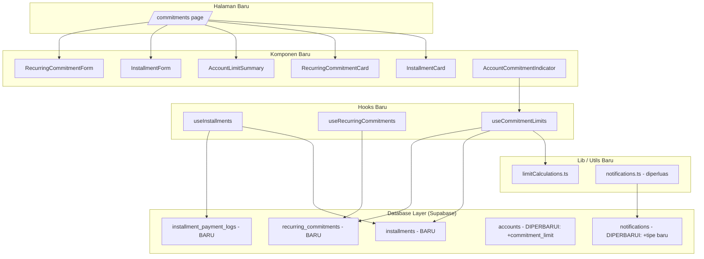
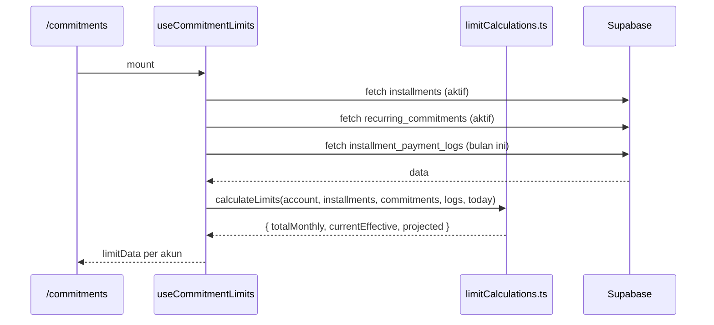

# Design Document: Installment & Commitment Tracker

## Overview

Dokumen ini menjelaskan desain teknis untuk fitur **Installment & Commitment Tracker** pada FinTrack. Fitur ini memungkinkan pengguna mencatat cicilan aktif (Cicilan_CC dan Cicilan_Non_CC) serta komitmen berulang (langganan, iuran, dll), lalu menghitung dua angka limit efektif per akun: **Limit_Real_Sekarang** (kondisi nyata hari ini) dan **Prediksi_Limit_Tagihan** (proyeksi setelah semua tagihan terpotong).

Fitur ini dibangun di atas arsitektur yang sudah ada (Next.js 14 App Router, Supabase, TanStack Query, Tailwind CSS) dengan menambahkan dua tabel baru (`installments` dan `recurring_commitments`), satu tabel log (`installment_payment_logs`), satu kolom baru di tabel `accounts` (`commitment_limit`), dua tipe notifikasi baru, dan satu halaman baru `/commitments`.

---

## Architecture

### High-Level Architecture



### Alur Data Kalkulasi Limit



---

## Components and Interfaces

### 1. Halaman `/commitments`

**Lokasi:** `src/app/(protected)/commitments/page.tsx`

Halaman utama Tracker. Menampilkan:
- Baris ringkasan total kewajiban semua akun di bagian atas
- Daftar akun yang memiliki cicilan/komitmen aktif, masing-masing dengan `AccountLimitSummary`
- Daftar cicilan aktif dan komitmen berulang per akun yang dipilih
- Tombol tambah cicilan dan tambah komitmen

### 2. AccountLimitSummary

**Lokasi:** `src/components/commitments/AccountLimitSummary.tsx`

Menampilkan ringkasan limit per akun: nama akun, limit resmi, Total_Kewajiban_Bulanan, Limit_Real_Sekarang, dan Prediksi_Limit_Tagihan.

```typescript
interface AccountLimitSummaryProps {
  account: Account;
  totalMonthlyObligation: number;
  currentEffectiveLimit: number | null; // null jika limit tidak dikonfigurasi
  projectedEffectiveLimit: number | null;
}
```

### 3. InstallmentCard

**Lokasi:** `src/components/commitments/InstallmentCard.tsx`

Menampilkan detail satu cicilan aktif.

```typescript
interface InstallmentCardProps {
  installment: Installment;
  paymentLog: InstallmentPaymentLog | null; // log bulan berjalan (Non-CC)
  today: Date;
  onConfirmPayment?: (installmentId: string) => void;
  onEdit: (installment: Installment) => void;
  onDelete: (installment: Installment) => void;
}
```

Untuk Cicilan_CC: menampilkan badge "Sudah terpotong" atau "Belum jatuh tempo".
Untuk Cicilan_Non_CC: menampilkan badge "Sudah dibayar" atau "Belum dibayar" + tombol konfirmasi jika unpaid.

### 4. RecurringCommitmentCard

**Lokasi:** `src/components/commitments/RecurringCommitmentCard.tsx`

```typescript
interface RecurringCommitmentCardProps {
  commitment: RecurringCommitment;
  onToggleActive: (id: string, isActive: boolean) => void;
  onEdit: (commitment: RecurringCommitment) => void;
  onDelete: (commitment: RecurringCommitment) => void;
}
```

### 5. InstallmentForm

**Lokasi:** `src/components/commitments/InstallmentForm.tsx`

Modal form untuk tambah/edit cicilan.

```typescript
interface InstallmentFormProps {
  open: boolean;
  onClose: () => void;
  onSubmit: (data: InstallmentFormInput) => void;
  loading?: boolean;
  installment?: Installment | null; // null = mode tambah
  accounts: Account[];
}
```

Field: nama, akun (semua tipe), angsuran bulanan (IDR), tenor (bulan), tanggal mulai, tanggal jatuh tempo (1-31), catatan (opsional).
Tipe cicilan ditentukan otomatis dari tipe akun yang dipilih — tidak ada field tipe di form.

### 6. RecurringCommitmentForm

**Lokasi:** `src/components/commitments/RecurringCommitmentForm.tsx`

```typescript
interface RecurringCommitmentFormProps {
  open: boolean;
  onClose: () => void;
  onSubmit: (data: RecurringCommitmentFormInput) => void;
  loading?: boolean;
  commitment?: RecurringCommitment | null;
  accounts: Account[];
}
```

Field: nama, akun (semua tipe), jumlah per bulan (IDR), catatan (opsional).

### 7. AccountCommitmentIndicator

**Lokasi:** `src/components/accounts/AccountCommitmentIndicator.tsx`

Komponen kecil yang ditambahkan ke `AccountCard` jika akun memiliki cicilan/komitmen aktif.

```typescript
interface AccountCommitmentIndicatorProps {
  totalMonthlyObligation: number;
  currentEffectiveLimit: number | null;
  projectedEffectiveLimit: number | null;
  onClick: () => void; // navigasi ke /commitments?account={id}
}
```

### 8. Hooks

#### useInstallments

**Lokasi:** `src/hooks/useInstallments.ts`

```typescript
// Query keys
export const installmentKeys = {
  all: ['installments'] as const,
  active: (userId: string) => [...installmentKeys.all, 'active', userId] as const,
  completed: (userId: string) => [...installmentKeys.all, 'completed', userId] as const,
  paymentLogs: (userId: string, month: string) =>
    [...installmentKeys.all, 'logs', userId, month] as const,
};

// Hooks yang diekspor
function useActiveInstallments(): UseQueryResult<Installment[]>;
function useCompletedInstallments(): UseQueryResult<Installment[]>;
function useInstallmentPaymentLogs(month: string): UseQueryResult<InstallmentPaymentLog[]>;
function useCreateInstallment(): UseMutationResult;
function useUpdateInstallment(): UseMutationResult;
function useDeleteInstallment(): UseMutationResult;
function useConfirmPayment(): UseMutationResult; // untuk Non-CC
```

#### useRecurringCommitments

**Lokasi:** `src/hooks/useRecurringCommitments.ts`

```typescript
export const commitmentKeys = {
  all: ['recurring_commitments'] as const,
  active: (userId: string) => [...commitmentKeys.all, 'active', userId] as const,
  all_list: (userId: string) => [...commitmentKeys.all, 'list', userId] as const,
};

function useActiveCommitments(): UseQueryResult<RecurringCommitment[]>;
function useCreateCommitment(): UseMutationResult;
function useUpdateCommitment(): UseMutationResult;
function useDeleteCommitment(): UseMutationResult;
function useToggleCommitmentActive(): UseMutationResult;
```

#### useCommitmentLimits

**Lokasi:** `src/hooks/useCommitmentLimits.ts`

Hook komposit yang menggabungkan data cicilan, komitmen, dan log pembayaran untuk menghitung limit per akun.

```typescript
interface AccountLimitData {
  accountId: string;
  totalMonthlyObligation: number;
  currentEffectiveLimit: number | null;
  projectedEffectiveLimit: number | null;
}

function useCommitmentLimits(accounts: Account[]): {
  data: Record<string, AccountLimitData>;
  isLoading: boolean;
};
```

### 9. Utility: limitCalculations.ts

**Lokasi:** `src/lib/limitCalculations.ts`

Fungsi-fungsi kalkulasi murni (pure functions) yang tidak bergantung pada Supabase.

```typescript
/**
 * Menentukan apakah angsuran CC sudah terpotong bulan ini.
 * Angsuran_Sudah_Terpotong = hari_ini >= due_day
 */
export function isInstallmentDeducted(today: Date, dueDay: number): boolean;

/**
 * Menghitung Sisa_Tenor dalam bulan.
 * Sisa_Tenor = max(0, (tahun_akhir * 12 + bulan_akhir) - (tahun_sekarang * 12 + bulan_sekarang))
 */
export function calculateRemainingTenor(startDate: Date, tenorMonths: number, today: Date): number;

/**
 * Menghitung total sisa hutang cicilan.
 * total_sisa = angsuran_bulanan * sisa_tenor
 */
export function calculateRemainingDebt(monthlyAmount: number, remainingTenor: number): number;

/**
 * Menghitung Total_Kewajiban_Bulanan per akun.
 * = sum(angsuran aktif) + sum(komitmen aktif)
 */
export function calculateTotalMonthlyObligation(
  installments: Installment[],
  commitments: RecurringCommitment[]
): number;

/**
 * Menghitung Limit_Real_Sekarang untuk akun credit_card.
 * = credit_limit - sum(angsuran CC yang sudah terpotong) - sum(komitmen yang sudah jatuh tempo)
 */
export function calculateCurrentEffectiveLimitCC(
  creditLimit: number,
  installments: Installment[],
  commitments: RecurringCommitment[],
  today: Date
): number;

/**
 * Menghitung Limit_Real_Sekarang untuk akun non-CC.
 * = commitment_limit - sum(angsuran Non-CC yang sudah paid bulan ini) - sum(komitmen yang sudah jatuh tempo)
 */
export function calculateCurrentEffectiveLimitNonCC(
  commitmentLimit: number,
  installments: Installment[],
  commitments: RecurringCommitment[],
  paymentLogs: InstallmentPaymentLog[],
  today: Date
): number;

/**
 * Menghitung Prediksi_Limit_Tagihan.
 * = limit - Total_Kewajiban_Bulanan
 */
export function calculateProjectedEffectiveLimit(
  limit: number,
  totalMonthlyObligation: number
): number;
```

---

## Data Models

### Tabel Baru: `installments`

```sql
CREATE TABLE installments (
  id UUID PRIMARY KEY DEFAULT gen_random_uuid(),
  user_id UUID REFERENCES auth.users(id) NOT NULL,
  account_id UUID REFERENCES accounts(id) NOT NULL,
  name TEXT NOT NULL,
  installment_type TEXT NOT NULL CHECK (installment_type IN ('cc', 'non_cc')),
  monthly_amount BIGINT NOT NULL CHECK (monthly_amount > 0),
  tenor_months INTEGER NOT NULL CHECK (tenor_months >= 1),
  start_date DATE NOT NULL,
  due_day INTEGER NOT NULL CHECK (due_day BETWEEN 1 AND 31),
  note TEXT,
  status TEXT NOT NULL DEFAULT 'active' CHECK (status IN ('active', 'completed')),
  created_at TIMESTAMPTZ NOT NULL DEFAULT now(),
  updated_at TIMESTAMPTZ NOT NULL DEFAULT now()
);

ALTER TABLE installments ENABLE ROW LEVEL SECURITY;
CREATE POLICY "Users can only access own installments"
  ON installments FOR ALL
  USING (auth.uid() = user_id)
  WITH CHECK (auth.uid() = user_id);

CREATE INDEX idx_installments_user_status ON installments(user_id, status);
CREATE INDEX idx_installments_user_account ON installments(user_id, account_id);
```

**Catatan desain:** `installment_type` disimpan di DB meskipun bisa diturunkan dari tipe akun, untuk memudahkan query dan menghindari JOIN yang tidak perlu. Nilai ini di-set saat insert berdasarkan tipe akun yang dipilih.

### Tabel Baru: `recurring_commitments`

```sql
CREATE TABLE recurring_commitments (
  id UUID PRIMARY KEY DEFAULT gen_random_uuid(),
  user_id UUID REFERENCES auth.users(id) NOT NULL,
  account_id UUID REFERENCES accounts(id) NOT NULL,
  name TEXT NOT NULL,
  monthly_amount BIGINT NOT NULL CHECK (monthly_amount > 0),
  is_active BOOLEAN NOT NULL DEFAULT true,
  note TEXT,
  created_at TIMESTAMPTZ NOT NULL DEFAULT now(),
  updated_at TIMESTAMPTZ NOT NULL DEFAULT now()
);

ALTER TABLE recurring_commitments ENABLE ROW LEVEL SECURITY;
CREATE POLICY "Users can only access own recurring_commitments"
  ON recurring_commitments FOR ALL
  USING (auth.uid() = user_id)
  WITH CHECK (auth.uid() = user_id);

CREATE INDEX idx_recurring_commitments_user_active ON recurring_commitments(user_id, is_active);
CREATE INDEX idx_recurring_commitments_user_account ON recurring_commitments(user_id, account_id);
```

### Tabel Baru: `installment_payment_logs`

```sql
CREATE TABLE installment_payment_logs (
  id UUID PRIMARY KEY DEFAULT gen_random_uuid(),
  installment_id UUID REFERENCES installments(id) ON DELETE CASCADE NOT NULL,
  user_id UUID REFERENCES auth.users(id) NOT NULL,
  payment_month DATE NOT NULL, -- tanggal pertama bulan (YYYY-MM-01)
  status TEXT NOT NULL DEFAULT 'unpaid' CHECK (status IN ('paid', 'unpaid')),
  confirmed_at TIMESTAMPTZ,
  created_at TIMESTAMPTZ NOT NULL DEFAULT now(),
  UNIQUE (installment_id, payment_month)
);

ALTER TABLE installment_payment_logs ENABLE ROW LEVEL SECURITY;
CREATE POLICY "Users can only access own payment_logs"
  ON installment_payment_logs FOR ALL
  USING (auth.uid() = user_id)
  WITH CHECK (auth.uid() = user_id);

CREATE INDEX idx_payment_logs_installment_month ON installment_payment_logs(installment_id, payment_month);
CREATE INDEX idx_payment_logs_user_month ON installment_payment_logs(user_id, payment_month);
```

**Catatan desain:** Log dibuat secara lazy — hanya dibuat saat User pertama kali membuka halaman Tracker untuk bulan tersebut, atau saat User mengkonfirmasi pembayaran. Jika log untuk bulan berjalan tidak ada, status dianggap `unpaid`.

### Perubahan Tabel `accounts`

```sql
-- Migration: 00013_installment_tracker.sql
ALTER TABLE accounts ADD COLUMN commitment_limit BIGINT;
```

Kolom ini nullable — hanya diisi untuk akun non-CC yang ingin menggunakan fitur kalkulasi limit.

### Perubahan Tabel `notifications`

```sql
ALTER TABLE notifications
  DROP CONSTRAINT notifications_type_check;

ALTER TABLE notifications
  ADD CONSTRAINT notifications_type_check
    CHECK (type IN (
      'budget_alert', 'cc_reminder', 'large_transaction',
      'goal_milestone', 'payment_due_today', 'commitment_alert'
    ));
```

### TypeScript Types Baru

```typescript
// src/types/index.ts — tambahan

export type InstallmentType = 'cc' | 'non_cc';
export type InstallmentStatus = 'active' | 'completed';
export type PaymentLogStatus = 'paid' | 'unpaid';

// Perbarui NotificationType
export type NotificationType =
  | 'budget_alert'
  | 'cc_reminder'
  | 'large_transaction'
  | 'goal_milestone'
  | 'payment_due_today'
  | 'commitment_alert';

export interface Installment {
  id: string;
  user_id: string;
  account_id: string;
  name: string;
  installment_type: InstallmentType;
  monthly_amount: number;
  tenor_months: number;
  start_date: string;
  due_day: number;
  note: string | null;
  status: InstallmentStatus;
  created_at: string;
  updated_at: string;
}

export interface RecurringCommitment {
  id: string;
  user_id: string;
  account_id: string;
  name: string;
  monthly_amount: number;
  is_active: boolean;
  note: string | null;
  created_at: string;
  updated_at: string;
}

export interface InstallmentPaymentLog {
  id: string;
  installment_id: string;
  user_id: string;
  payment_month: string; // format: YYYY-MM-01
  status: PaymentLogStatus;
  confirmed_at: string | null;
  created_at: string;
}

// Form inputs
export interface InstallmentFormInput {
  account_id: string;
  name: string;
  monthly_amount: number;
  tenor_months: number;
  start_date: string;
  due_day: number;
  note?: string;
}

export interface RecurringCommitmentFormInput {
  account_id: string;
  name: string;
  monthly_amount: number;
  note?: string;
}

// Perbarui Account untuk commitment_limit
// export interface Account { ...existing, commitment_limit: number | null }

// Perbarui AccountFormInput
// export interface AccountFormInput { ...existing, commitment_limit?: number }
```

---

## Correctness Properties

*A property is a characteristic or behavior that should hold true across all valid executions of a system — essentially, a formal statement about what the system should do. Properties serve as the bridge between human-readable specifications and machine-verifiable correctness guarantees.*

### Property 1: Penentuan Tipe Cicilan Otomatis

*For any* akun dengan tipe apapun, tipe cicilan yang ditentukan secara otomatis SHALL selalu `cc` jika dan hanya jika tipe akun adalah `credit_card`, dan SHALL selalu `non_cc` untuk semua tipe akun lainnya.

**Validates: Requirements 1.2**

### Property 2: Kalkulasi Sisa Tenor dan Total Sisa Hutang

*For any* cicilan dengan tanggal mulai, tenor, dan angsuran bulanan yang valid, Sisa_Tenor SHALL sama dengan `max(0, (tahun_akhir * 12 + bulan_akhir) - (tahun_sekarang * 12 + bulan_sekarang))`, dan total sisa hutang SHALL sama dengan `angsuran_bulanan * sisa_tenor`.

**Validates: Requirements 1.3, 1.4**

### Property 3: Validasi Input Cicilan dan Komitmen

*For any* input form cicilan dengan tenor < 1, angsuran <= 0, atau due_day di luar rentang 1-31, dan *for any* input form komitmen dengan jumlah <= 0, fungsi validasi SHALL menolak input tersebut dan mengembalikan pesan error yang sesuai.

**Validates: Requirements 1.6, 2.4**

### Property 4: Status Angsuran CC (Angsuran_Sudah_Terpotong)

*For any* Cicilan_CC aktif dengan due_day tertentu dan tanggal hari ini tertentu, kondisi Angsuran_Sudah_Terpotong SHALL bernilai `true` jika dan hanya jika `hari_ini >= due_day` dalam bulan berjalan.

**Validates: Requirements 1a.1**

### Property 5: Status Awal Pembayaran Non-CC

*For any* Cicilan_Non_CC yang baru dibuat, status pembayaran bulan berjalan SHALL selalu dimulai sebagai `unpaid`.

**Validates: Requirements 1b.1**

### Property 6: Konfirmasi Pembayaran Non-CC

*For any* Cicilan_Non_CC dengan status pembayaran bulan berjalan `unpaid`, setelah User mengkonfirmasi pembayaran, status SHALL berubah menjadi `paid` dan tidak dapat kembali ke `unpaid` untuk bulan yang sama.

**Validates: Requirements 1b.3**

### Property 7: Total_Kewajiban_Bulanan adalah Jumlah Semua Kewajiban Aktif

*For any* akun dengan sejumlah cicilan aktif dan komitmen berulang aktif, Total_Kewajiban_Bulanan SHALL sama dengan jumlah semua `monthly_amount` cicilan aktif ditambah jumlah semua `monthly_amount` komitmen berulang aktif. Komitmen yang dinonaktifkan SHALL tidak masuk dalam perhitungan.

**Validates: Requirements 3.1, 2.3**

### Property 8: Prediksi_Limit_Tagihan = Limit - Total_Kewajiban_Bulanan

*For any* akun (baik CC maupun non-CC) dengan limit yang dikonfigurasi dan sejumlah kewajiban aktif, Prediksi_Limit_Tagihan SHALL selalu sama dengan `limit - Total_Kewajiban_Bulanan`, tanpa memandang status pemotongan atau status pembayaran bulan berjalan.

**Validates: Requirements 3.3, 3.5**

### Property 9: Limit_Real_Sekarang Mencerminkan Kewajiban yang Sudah Terealisasi

*For any* akun CC dengan credit_limit, Limit_Real_Sekarang SHALL sama dengan `credit_limit - sum(angsuran CC yang Angsuran_Sudah_Terpotong = true)`. *For any* akun non-CC dengan commitment_limit, Limit_Real_Sekarang SHALL sama dengan `commitment_limit - sum(angsuran Non-CC dengan status paid bulan ini)`.

**Validates: Requirements 3.2, 3.4**

### Property 10: Deduplication Notifikasi

*For any* akun dan *for any* cicilan, mengevaluasi kondisi notifikasi (`commitment_alert` atau `payment_due_today`) berkali-kali dalam satu hari kalender yang sama SHALL menghasilkan paling banyak satu notifikasi per tipe per entitas per hari.

**Validates: Requirements 8.3, 8.7**

### Property 11: Pembuatan Notifikasi commitment_alert

*For any* akun dengan limit yang dikonfigurasi, jika Prediksi_Limit_Tagihan < 10% dari limit resmi, sistem SHALL membuat notifikasi `commitment_alert`. Jika Prediksi_Limit_Tagihan negatif, pesan notifikasi SHALL menyatakan bahwa kewajiban telah melebihi limit.

**Validates: Requirements 8.1, 8.2**

### Property 12: Format IDR Konsisten

*For any* nilai moneter (angsuran, total sisa hutang, Total_Kewajiban_Bulanan, Limit_Real_Sekarang, Prediksi_Limit_Tagihan), nilai tersebut SHALL selalu diformat sebagai string IDR yang dimulai dengan "Rp" dan menggunakan pemisah ribuan titik.

**Validates: Requirements 10.1**

---

## Error Handling

### Operasi CRUD Cicilan dan Komitmen
- **Gagal simpan/edit/hapus**: Tampilkan Error_Toast dengan pesan deskriptif dan tombol "Coba Lagi". Optimistic update di-rollback ke state sebelumnya mengikuti pola yang sudah ada di `useAccounts` dan `useGoals`.
- **Validasi gagal di client**: Tampilkan pesan error inline di bawah field yang bermasalah sebelum submit. Tidak ada request ke server.
- **Akun tidak ditemukan**: Jika akun yang dipilih tidak valid atau bukan milik user, tampilkan error dan batalkan operasi.

### Konfirmasi Pembayaran Non-CC
- **Gagal konfirmasi**: Tampilkan Error_Toast. Status tetap `unpaid`. User bisa mencoba lagi.
- **Konfirmasi ganda** (race condition): Gunakan UNIQUE constraint `(installment_id, payment_month)` di DB untuk mencegah duplikasi log.

### Kalkulasi Limit
- **Limit tidak dikonfigurasi**: Tampilkan "Tidak dikonfigurasi" alih-alih angka. Tidak ada kalkulasi numerik yang dilakukan.
- **Cicilan selesai (sisa_tenor = 0)**: Cicilan yang sudah selesai tidak dimasukkan dalam kalkulasi. Status diperbarui ke `completed` secara otomatis saat halaman dimuat.

### Notifikasi
- **Gagal membuat notifikasi**: Error di-log tapi tidak mengganggu flow utama (operasi cicilan/komitmen tetap berhasil). Notifikasi akan dicoba lagi pada evaluasi berikutnya.
- **Deduplication key conflict**: Diabaikan (kode error `23505`), artinya notifikasi sudah ada — mengikuti pola yang sudah ada di `src/lib/notifications.ts`.

### Navigasi dari AccountCard
- **Akun tidak memiliki cicilan/komitmen**: Indikator tidak ditampilkan di AccountCard. Tidak ada navigasi ke Tracker.

---

## Testing Strategy

### Unit Tests (Example-Based)

- `InstallmentForm` menampilkan field yang benar untuk semua tipe akun
- `InstallmentForm` menentukan tipe cicilan otomatis berdasarkan tipe akun
- `InstallmentCard` menampilkan badge "Sudah terpotong" untuk Cicilan_CC dengan due_day <= hari ini
- `InstallmentCard` menampilkan tombol konfirmasi untuk Cicilan_Non_CC dengan status unpaid
- `AccountLimitSummary` menampilkan "Tidak dikonfigurasi" jika limit tidak diset
- `AccountLimitSummary` menampilkan nilai negatif dengan kelas CSS danger
- Halaman Tracker menampilkan empty state jika tidak ada cicilan/komitmen
- `AccountCommitmentIndicator` tidak ditampilkan jika akun tidak memiliki kewajiban aktif
- `AccountForm` menampilkan field `commitment_limit` untuk akun non-CC

### Property-Based Tests (Vitest + fast-check)

Library: `fast-check` (sudah digunakan di proyek)
Minimum 100 iterasi per property test.
Tag format: `Feature: installment-commitment-tracker, Property {number}: {judul}`

Properties yang diimplementasikan sebagai property-based tests:

1. **Penentuan tipe cicilan otomatis** — generate tipe akun acak, verifikasi tipe cicilan
2. **Kalkulasi Sisa_Tenor dan total sisa hutang** — generate tanggal dan tenor acak, verifikasi kalkulasi
3. **Validasi input** — generate nilai invalid acak, verifikasi penolakan
4. **Status Angsuran_Sudah_Terpotong** — generate (hari_ini, due_day) acak, verifikasi logika boolean
5. **Status awal Non-CC** — generate cicilan Non-CC baru, verifikasi status = unpaid
6. **Konfirmasi pembayaran Non-CC** — generate cicilan unpaid, konfirmasi, verifikasi status = paid
7. **Total_Kewajiban_Bulanan** — generate set cicilan dan komitmen acak, verifikasi penjumlahan
8. **Prediksi_Limit_Tagihan** — generate akun dan kewajiban acak, verifikasi = limit - total
9. **Limit_Real_Sekarang** — generate akun CC/non-CC acak, verifikasi kalkulasi sesuai tipe
10. **Deduplication notifikasi** — generate akun/cicilan acak, evaluasi berkali-kali, verifikasi max 1 notifikasi per hari
11. **Pembuatan commitment_alert** — generate akun dengan Prediksi < 10%, verifikasi notifikasi dibuat
12. **Format IDR** — generate nilai moneter acak, verifikasi format output

### Integration Tests

- RLS: User A tidak bisa membaca/mengubah cicilan User B
- RLS: User A tidak bisa membaca/mengubah komitmen User B
- UNIQUE constraint pada `installment_payment_logs(installment_id, payment_month)` mencegah duplikasi log
- Deduplication notifikasi via `deduplication_key` unique index
- Navigasi dari AccountCard ke halaman Tracker dengan akun yang sudah terpilih
