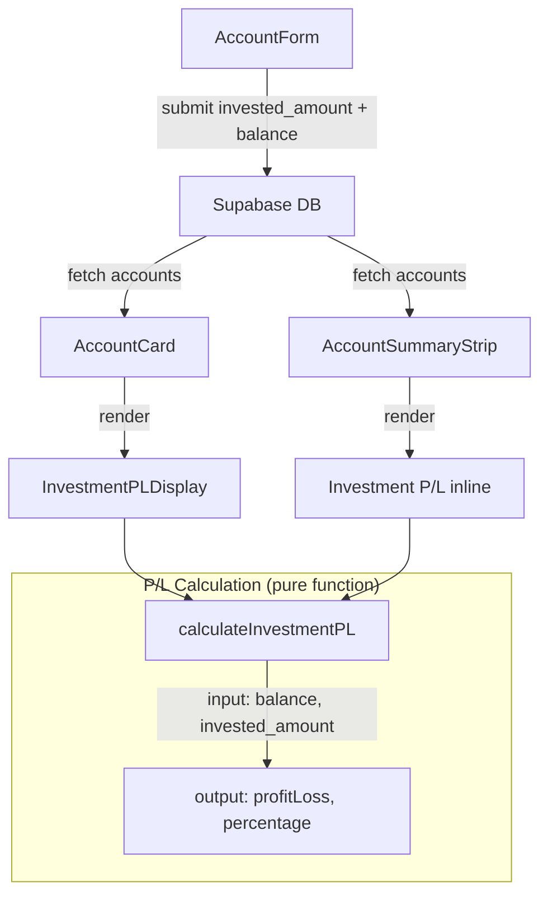

# Design Document: Investment Profit/Loss Tracking

## Overview

Fitur ini menambahkan pelacakan profit/loss untuk akun investasi dengan pendekatan sederhana: user menginput total modal (`invested_amount`) dan memperbarui nilai portofolio saat ini (`balance`) secara manual. Sistem menghitung P/L = balance - invested_amount dan menampilkannya di UI.

Berbeda dengan akun emas yang memerlukan harga live dari API eksternal, akun investasi sepenuhnya manual — user mengecek nilai portofolio di app platform (Stockbit, Pluang, dll) lalu memperbarui balance di FinTrack.

### Design Decisions

1. **Satu kolom `invested_amount` saja** — Tidak perlu tracking history top-up/withdrawal terpisah. User langsung mengedit invested_amount saat top-up atau withdrawal.
2. **Nullable field** — invested_amount nullable agar backward-compatible dengan akun investasi yang sudah ada. P/L hanya ditampilkan jika invested_amount terisi dan > 0.
3. **Mengikuti pola gold** — Implementasi UI mengikuti pola yang sudah ada pada GoldPriceDisplay dan AccountSummaryStrip untuk gold accounts, tapi lebih sederhana (tanpa async price fetching).

## Architecture



### Alur Data

1. User membuat/mengedit akun investasi via AccountForm → menyimpan `balance` dan `invested_amount` ke Supabase
2. Dashboard dan halaman akun fetch data akun dari Supabase
3. Komponen UI memanggil fungsi `calculateInvestmentPL(balance, invested_amount)` untuk mendapatkan P/L
4. P/L ditampilkan dengan warna hijau/merah sesuai nilai

## Components and Interfaces

### 1. Database Migration (`supabase/migrations/00011_investment_amount.sql`)

Menambahkan kolom `invested_amount` ke tabel accounts:

```sql
ALTER TABLE accounts ADD COLUMN invested_amount BIGINT;
```

Tidak perlu constraint khusus karena field ini nullable dan hanya relevan untuk tipe `investment` (tidak ada hard constraint seperti gold yang wajib diisi).

### 2. Pure Function: `calculateInvestmentPL`

Lokasi: `src/lib/investmentPL.ts`

```typescript
export interface InvestmentPLResult {
  profitLoss: number;
  percentage: number;
  isProfit: boolean;
}

export function calculateInvestmentPL(
  balance: number,
  investedAmount: number | null
): InvestmentPLResult | null {
  if (investedAmount === null || investedAmount <= 0) {
    return null;
  }
  const profitLoss = balance - investedAmount;
  const percentage = (profitLoss / investedAmount) * 100;
  return {
    profitLoss,
    percentage,
    isProfit: profitLoss >= 0,
  };
}
```

### 3. UI Component: `InvestmentPLDisplay`

Lokasi: `src/components/accounts/InvestmentPLDisplay.tsx`

Komponen yang menampilkan P/L di AccountCard, mirip dengan GoldPriceDisplay tapi lebih sederhana (tanpa loading state karena tidak ada API call).

```typescript
interface InvestmentPLDisplayProps {
  balance: number;
  investedAmount: number;
}
```

Menampilkan:
- Total Modal (invested_amount) dalam format IDR
- Nilai Saat Ini (balance) dalam format IDR  
- Profit/Loss dalam format IDR dengan warna hijau/merah
- Persentase P/L

### 4. AccountForm Extension

Menambahkan field "Modal Investasi" yang muncul ketika `type === 'investment'`:
- Label: "Modal Investasi (IDR)"
- Hint: "Total modal yang telah disetor ke platform"
- Input type: number, min: 0
- Validasi: tidak boleh negatif

### 5. AccountSummaryStrip Extension

Menambahkan rendering khusus untuk akun investasi (mirip gold):
- Jika invested_amount valid: tampilkan balance + P/L di bawahnya
- Jika invested_amount null/0: tampilkan balance saja (behavior existing)

### 6. AccountCard Extension

Menambahkan `InvestmentPLDisplay` di bawah balance untuk akun investasi yang memiliki invested_amount valid.

## Data Models

### Account Interface (updated)

```typescript
export interface Account {
  // ... existing fields ...
  invested_amount: number | null;  // NEW: total modal investasi
}
```

### AccountFormInput (updated)

```typescript
export interface AccountFormInput {
  // ... existing fields ...
  invested_amount?: number;  // NEW
}
```

### InvestmentPLResult

```typescript
export interface InvestmentPLResult {
  profitLoss: number;       // balance - invested_amount
  percentage: number;       // (profitLoss / invested_amount) * 100
  isProfit: boolean;        // profitLoss >= 0
}
```


## Correctness Properties

*A property is a characteristic or behavior that should hold true across all valid executions of a system — essentially, a formal statement about what the system should do. Properties serve as the bridge between human-readable specifications and machine-verifiable correctness guarantees.*

### Property 1: P/L Calculation Correctness

*For any* balance (number) and any valid invested_amount (number > 0), `calculateInvestmentPL(balance, investedAmount)` should return a result where `profitLoss === balance - investedAmount` and `percentage === ((balance - investedAmount) / investedAmount) * 100`.

**Validates: Requirements 2.1, 2.2**

### Property 2: Null Result for Invalid Inputs

*For any* invested_amount that is null or <= 0, `calculateInvestmentPL(balance, investedAmount)` should return null regardless of the balance value.

**Validates: Requirements 2.3**

### Property 3: isProfit Flag Correctness

*For any* balance and valid invested_amount (> 0), the `isProfit` field in the result should be `true` if and only if `balance >= investedAmount` (i.e., profitLoss >= 0).

**Validates: Requirements 2.4, 2.5, 2.6**

### Property 4: Negative Invested Amount Rejection

*For any* negative number provided as invested_amount in the AccountForm, the form should reject the submission and not call onSubmit.

**Validates: Requirements 5.4**

### Property 5: Form Field Visibility by Account Type

*For any* account type value, the "Modal Investasi" field should be visible if and only if the type is `investment`.

**Validates: Requirements 1.2, 1.3**

## Error Handling

| Scenario | Handling |
|----------|----------|
| invested_amount is null | P/L tidak ditampilkan, hanya balance |
| invested_amount is 0 | P/L tidak ditampilkan (division by zero prevention) |
| invested_amount negatif (form input) | Form menolak submit, tampilkan error |
| balance negatif (portofolio rugi besar) | P/L tetap dihitung normal, ditampilkan merah |
| Database migration gagal | Rollback otomatis, kolom tidak ditambahkan |

## Testing Strategy

### Property-Based Tests (fast-check)

Library: `fast-check` (sudah digunakan di project ini)

Setiap property test harus menjalankan minimum 100 iterasi.

| Property | Test Description | Tag |
|----------|-----------------|-----|
| Property 1 | Generate random balance & positive invested_amount, verify calculation | Feature: investment-profit-loss-tracking, Property 1: P/L Calculation Correctness |
| Property 2 | Generate random balance with null/zero/negative invested_amount, verify null result | Feature: investment-profit-loss-tracking, Property 2: Null Result for Invalid Inputs |
| Property 3 | Generate random balance & positive invested_amount, verify isProfit matches profitLoss >= 0 | Feature: investment-profit-loss-tracking, Property 3: isProfit Flag Correctness |

### Unit Tests (vitest)

| Component | Test Cases |
|-----------|-----------|
| `calculateInvestmentPL` | Specific examples: profit case, loss case, break-even, null input, zero input |
| `AccountForm` | Field visibility toggle, form submission with invested_amount, negative value rejection |
| `InvestmentPLDisplay` | Renders P/L with correct colors, handles edge cases |
| `AccountCard` | Shows InvestmentPLDisplay for investment accounts, hides for others |
| `AccountSummaryStrip` | Shows P/L for investment accounts with valid invested_amount |

### Test Configuration

```typescript
// vitest.config.ts — sudah ada di project
// fast-check configuration
fc.configureGlobal({ numRuns: 100 });
```
