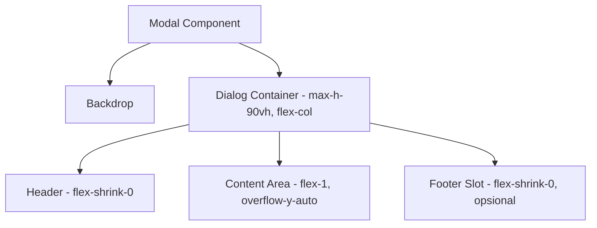

# Dokumen Desain: Modal Scroll Fix

## Overview

Perbaikan ini memodifikasi komponen `Modal` (`src/components/ui/Modal.tsx`) agar memiliki layout flexbox vertikal dengan max-height terbatas, sehingga area konten dapat di-scroll sementara header dan footer (action buttons) tetap terlihat. Pendekatan ini diterapkan di level komponen Modal sehingga semua modal di aplikasi otomatis mendapat perbaikan tanpa perlu mengubah komponen child.

### Pendekatan Desain

Menggunakan CSS flexbox dengan `flex-col` dan `overflow-y-auto` pada content area. Modal dialog diberi `max-h-[90vh]` dan menggunakan `flex flex-col` sehingga:
- Header (title + close button) tetap di atas
- Content area mengisi sisa ruang dan scrollable
- Action buttons di dalam children tetap terlihat karena content area yang terbatas

### Keputusan Desain Utama

1. **Modifikasi di level Modal component saja** — Tidak perlu mengubah setiap form/modal child. Ini memastikan backward compatibility.
2. **Menggunakan `max-h-[90vh]`** — Memberikan ruang 10% untuk padding visual dari edge layar.
3. **Mobile-first dengan `max-h-[85dvh]` pada mobile** — Menggunakan `dvh` (dynamic viewport height) yang memperhitungkan address bar browser mobile.
4. **Footer slot opsional** — Menambahkan prop `footer` pada Modal untuk memisahkan action buttons dari scrollable content. Ini opsional untuk backward compatibility.

## Architecture



### Layout Structure

```
┌─────────────────────────────┐
│  Header (fixed)             │  ← flex-shrink-0
│  Title + Close Button       │
├─────────────────────────────┤
│                             │
│  Content Area (scrollable)  │  ← flex-1, overflow-y-auto
│  - Form fields              │
│  - Account lists            │
│  - dll                      │
│                             │
├─────────────────────────────┤
│  Footer (fixed, opsional)   │  ← flex-shrink-0
│  Action Buttons             │
└─────────────────────────────┘
```

## Components and Interfaces

### Modal Component (Updated)

```typescript
export interface ModalProps {
  open: boolean;
  onClose: () => void;
  title: string;
  children: React.ReactNode;
  className?: string;
  /** Opsional: konten footer yang tetap terlihat di bawah (tidak ikut scroll) */
  footer?: React.ReactNode;
}
```

### Perubahan CSS pada Dialog Container

```
Sebelum: `relative z-10 w-full max-w-lg mx-4 bg-surface rounded-xl shadow-lg`
Sesudah: `relative z-10 w-full max-w-lg mx-4 bg-surface rounded-xl shadow-lg flex flex-col max-h-[90vh] sm:max-h-[85vh]`
```

### Perubahan CSS pada Content Area

```
Sebelum: `<div className="p-4">{children}</div>`
Sesudah: `<div className="p-4 flex-1 overflow-y-auto min-h-0">{children}</div>`
```

### Footer Section (Baru, Opsional)

```tsx
{footer && (
  <div className="flex-shrink-0 p-4 border-t border-border">
    {footer}
  </div>
)}
```

## Data Models

Tidak ada perubahan data model. Fitur ini murni perubahan UI/CSS.


## Correctness Properties

*A property is a characteristic or behavior that should hold true across all valid executions of a system — essentially, a formal statement about what the system should do. Properties serve as the bridge between human-readable specifications and machine-verifiable correctness guarantees.*

### Property 1: Modal height tidak melebihi viewport

*For any* konten yang diberikan ke Modal (termasuk konten yang sangat panjang), tinggi rendered modal tidak boleh melebihi 90% dari tinggi viewport.

**Validates: Requirements 1.1, 1.2**

### Property 2: Content area menjadi scrollable saat overflow

*For any* konten yang tingginya melebihi ruang tersedia di content area, elemen content area harus memiliki `scrollHeight > clientHeight` dan `overflow-y` bernilai `auto`.

**Validates: Requirements 2.1, 2.3**

### Property 3: Action buttons tetap terlihat saat scroll

*For any* modal dengan konten yang overflow, ketika content area di-scroll, elemen action buttons (footer) harus tetap berada dalam visible viewport area modal (tidak ikut ter-scroll keluar dari pandangan).

**Validates: Requirements 2.2, 3.1, 3.2**

### Property 4: Backward compatibility — semua children render dengan benar

*For any* komponen child yang valid (form, list, dll), Modal harus menerapkan layout scrollable secara default dan me-render children tanpa perubahan visual atau fungsional dibanding sebelumnya (kecuali penambahan scroll behavior).

**Validates: Requirements 4.1, 4.4**

## Error Handling

| Skenario | Penanganan |
|----------|-----------|
| Konten kosong | Modal tetap render dengan ukuran minimal, tidak ada scrollbar |
| Footer prop tidak diberikan | Modal berfungsi seperti sebelumnya, action buttons di dalam children |
| Browser tidak mendukung `dvh` | Fallback ke `vh` yang sudah didefinisikan |
| Modal dibuka saat keyboard virtual aktif | Layout tetap menggunakan dynamic viewport height |

## Testing Strategy

### Unit Tests

- Verifikasi Modal render dengan benar saat `open={true}`
- Verifikasi Modal memiliki class `max-h-[90vh]` dan `flex flex-col`
- Verifikasi content area memiliki class `overflow-y-auto` dan `min-h-0`
- Verifikasi footer slot render ketika prop `footer` diberikan
- Verifikasi footer tidak render ketika prop `footer` tidak diberikan
- Verifikasi backward compatibility: existing modals (BudgetForm, GoalForm, dll) render tanpa error

### Property-Based Tests

Library: `fast-check` dengan `@testing-library/react`

Konfigurasi: minimum 100 iterasi per property test.

- **Feature: modal-scroll-fix, Property 1: Modal height tidak melebihi viewport**
  - Generate konten dengan panjang acak (1-100 item), render Modal, verifikasi computed height <= 90vh

- **Feature: modal-scroll-fix, Property 2: Content area menjadi scrollable saat overflow**
  - Generate konten yang melebihi container height, verifikasi overflow-y auto aktif dan scrollHeight > clientHeight

- **Feature: modal-scroll-fix, Property 3: Action buttons tetap terlihat saat scroll**
  - Generate modal dengan footer dan konten panjang acak, scroll content area, verifikasi footer position tetap visible

- **Feature: modal-scroll-fix, Property 4: Backward compatibility**
  - Generate berbagai children (form elements, lists, text), render di Modal, verifikasi tidak ada error dan children accessible
