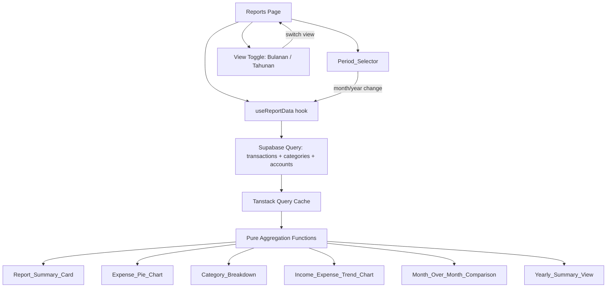

# Design Document

## Overview

Fitur Laporan Bulanan/Tahunan menambahkan halaman analitik `/reports` ke FinTrack yang memungkinkan pengguna memvisualisasikan data keuangan dalam periode bulanan dan tahunan. Halaman ini menampilkan pie chart distribusi pengeluaran per kategori, grafik batang tren pemasukan vs pengeluaran, perbandingan month-over-month, dan ringkasan tahunan. Fitur ini sepenuhnya memanfaatkan tabel `transactions`, `categories`, dan `accounts` yang sudah ada — tidak ada tabel database baru yang diperlukan. Visualisasi menggunakan Recharts (PieChart, BarChart) dengan ResponsiveContainer, dan semua teks UI dalam Bahasa Indonesia dengan format IDR.

## Architecture

### Integrasi dengan Arsitektur Existing

Fitur ini mengikuti pola arsitektur FinTrack yang sudah ada:

- Route baru `(protected)/reports/page.tsx` di dalam App Router
- Custom hook `useReports` untuk data fetching via Tanstack Query
- Komponen presentasi di `src/components/reports/`
- Reuse komponen UI existing: `Card`, `SkeletonLoader`, `EmptyState`, `ErrorState`
- Navigasi: tambah item "Laporan" ke `Sidebar` dan `BottomNav`

### Data Flow



### File Structure

```
src/
├── app/(protected)/reports/
│   └── page.tsx                          # Reports page
├── components/reports/
│   ├── PeriodSelector.tsx                # Month/year navigation
│   ├── ViewToggle.tsx                    # Bulanan/Tahunan tab toggle
│   ├── ReportSummaryCard.tsx             # Income/expense/net summary
│   ├── ExpensePieChart.tsx               # Recharts PieChart wrapper
│   ├── CategoryBreakdown.tsx             # Sorted category list with bars
│   ├── IncomeExpenseTrendChart.tsx        # Recharts BarChart 6-month trend
│   ├── MonthOverMonthComparison.tsx       # MoM comparison cards
│   ├── YearlySummaryView.tsx             # Annual summary + 12-month chart
│   └── ReportSkeletonLoader.tsx          # Skeleton for reports page
├── hooks/
│   └── useReports.ts                     # Data fetching + caching
└── lib/
    └── report-utils.ts                   # Pure aggregation/calculation functions
```

## Components and Interfaces

### PeriodSelector

Komponen navigasi bulan/tahun dengan tombol prev/next. Menampilkan nama bulan dalam Bahasa Indonesia dan tahun. Tidak mengizinkan navigasi ke bulan di masa depan.

```typescript
interface PeriodSelectorProps {
  month: number;        // 0-11
  year: number;
  onPrevious: () => void;
  onNext: () => void;
  canGoNext: boolean;   // false jika sudah di bulan berjalan
}
```

### ViewToggle

Tab toggle antara "Bulanan" dan "Tahunan". Default ke "Bulanan".

```typescript
type ReportView = 'monthly' | 'yearly';

interface ViewToggleProps {
  activeView: ReportView;
  onViewChange: (view: ReportView) => void;
}
```

### ReportSummaryCard

Menampilkan total pemasukan, total pengeluaran, dan selisih bersih. Reuse pola dari `MonthlySummaryCard` yang sudah ada.

```typescript
interface ReportSummaryCardProps {
  totalIncome: number;
  totalExpenses: number;
  netChange: number;
}
```

### ExpensePieChart

Recharts PieChart yang menampilkan distribusi pengeluaran per kategori. Menampilkan label persentase dan tooltip dengan nama kategori + jumlah IDR. Menyertakan tabel data alternatif untuk aksesibilitas screen reader.

```typescript
interface CategoryExpense {
  categoryId: string;
  categoryName: string;
  categoryIcon: string;
  amount: number;
  percentage: number;
  color: string;
}

interface ExpensePieChartProps {
  data: CategoryExpense[];
  totalExpenses: number;
}
```

### CategoryBreakdown

Daftar rincian pengeluaran per kategori, diurutkan dari terbesar ke terkecil. Setiap item menampilkan ikon, nama, jumlah IDR, persentase, dan progress bar berwarna.

```typescript
interface CategoryBreakdownProps {
  data: CategoryExpense[];
}
```

### IncomeExpenseTrendChart

Recharts BarChart yang menampilkan tren pemasukan vs pengeluaran selama 6 bulan (tampilan bulanan) atau 12 bulan (tampilan tahunan). Label bulan dalam format singkat Bahasa Indonesia. Sumbu Y dalam format IDR singkat (misalnya "1,5jt").

```typescript
interface MonthlyTrendData {
  month: string;       // "Jan", "Feb", etc.
  monthFull: string;   // "Januari 2024"
  income: number;
  expense: number;
}

interface IncomeExpenseTrendChartProps {
  data: MonthlyTrendData[];
}
```

### MonthOverMonthComparison

Menampilkan perbandingan metrik antara bulan yang dipilih dan bulan sebelumnya. Menampilkan percentage change dengan indikator warna dan arah panah. Logika warna terbalik untuk pengeluaran (naik = merah, turun = hijau).

```typescript
interface ComparisonMetric {
  label: string;
  currentValue: number;
  previousValue: number;
  percentageChange: number | null;  // null jika bulan sebelumnya tidak ada data
  isExpense: boolean;               // true = logika warna terbalik
}

interface MonthOverMonthComparisonProps {
  metrics: ComparisonMetric[];
}
```

### YearlySummaryView

Tampilan ringkasan tahunan: total pemasukan/pengeluaran/selisih tahunan, rata-rata bulanan, dan grafik batang 12 bulan.

```typescript
interface YearlySummaryData {
  year: number;
  totalIncome: number;
  totalExpenses: number;
  netChange: number;
  avgMonthlyIncome: number;
  avgMonthlyExpenses: number;
  monthlyData: MonthlyTrendData[];
}

interface YearlySummaryViewProps {
  data: YearlySummaryData;
}
```

### useReports Hook

Custom hook yang mengambil data transaksi untuk periode yang dipilih dan menghitung semua agregasi.

```typescript
interface UseReportsParams {
  month: number;
  year: number;
  view: ReportView;
}

interface UseReportsResult {
  // Monthly view data
  summary: { totalIncome: number; totalExpenses: number; netChange: number } | null;
  categoryExpenses: CategoryExpense[];
  trendData: MonthlyTrendData[];
  comparison: ComparisonMetric[];
  // Yearly view data
  yearlySummary: YearlySummaryData | null;
  // State
  isLoading: boolean;
  error: Error | null;
  refetch: () => void;
}
```

## Data Models

### Tidak Ada Tabel Baru

Fitur ini sepenuhnya menggunakan tabel yang sudah ada:

- `transactions` — sumber data utama, difilter berdasarkan `user_id`, `date`, dan `type`
- `categories` — untuk nama dan ikon kategori pada pie chart dan breakdown
- `accounts` — untuk filter `is_deleted` (mengecualikan akun yang di-soft-delete)

### Query Patterns

**Monthly Data Query** — mengambil semua transaksi untuk bulan yang dipilih:
```sql
SELECT t.*, c.name as category_name, c.icon as category_icon
FROM transactions t
LEFT JOIN categories c ON t.category_id = c.id
JOIN accounts a ON t.account_id = a.id
WHERE t.user_id = :userId
  AND t.date >= :monthStart
  AND t.date < :nextMonthStart
  AND a.is_deleted = false
ORDER BY t.date DESC;
```

**6-Month Trend Query** — mengambil transaksi untuk 6 bulan terakhir dari bulan yang dipilih:
```sql
SELECT t.type, t.amount, t.date
FROM transactions t
JOIN accounts a ON t.account_id = a.id
WHERE t.user_id = :userId
  AND t.date >= :sixMonthsAgo
  AND t.date < :nextMonthStart
  AND a.is_deleted = false
  AND t.type IN ('income', 'expense');
```

**Yearly Data Query** — mengambil transaksi untuk seluruh tahun kalender:
```sql
SELECT t.type, t.amount, t.date
FROM transactions t
JOIN accounts a ON t.account_id = a.id
WHERE t.user_id = :userId
  AND t.date >= ':year-01-01'
  AND t.date < ':nextYear-01-01'
  AND a.is_deleted = false
  AND t.type IN ('income', 'expense');
```

### Pure Aggregation Functions (report-utils.ts)

Semua kalkulasi dilakukan di sisi klien menggunakan fungsi pure yang mudah diuji:

```typescript
// Menghitung total pemasukan, pengeluaran, dan selisih bersih
// Mengecualikan transfer dari perhitungan
function calculateReportSummary(transactions: Transaction[]): ReportSummary;

// Mengelompokkan pengeluaran per kategori, menghitung persentase, dan mengurutkan
function calculateCategoryExpenses(
  transactions: Transaction[],
  categories: Category[]
): CategoryExpense[];

// Mengelompokkan transaksi per bulan dan menghitung total pemasukan/pengeluaran per bulan
function calculateMonthlyTrend(
  transactions: Transaction[],
  months: number  // 6 atau 12
): MonthlyTrendData[];

// Menghitung percentage change antara dua nilai
// Mengembalikan null jika nilai sebelumnya 0
function calculatePercentageChange(current: number, previous: number): number | null;

// Membangun metrik perbandingan month-over-month
function calculateMonthOverMonth(
  currentTransactions: Transaction[],
  previousTransactions: Transaction[]
): ComparisonMetric[];

// Menghitung ringkasan tahunan termasuk rata-rata bulanan
function calculateYearlySummary(
  transactions: Transaction[],
  year: number
): YearlySummaryData;

// Format angka IDR singkat untuk sumbu Y chart
// 1500000 → "1,5jt", 500000 → "500rb"
function formatIDRShort(amount: number): string;

// Nama bulan singkat Bahasa Indonesia
function getShortMonthName(monthIndex: number): string;

// Nama bulan penuh Bahasa Indonesia
function getFullMonthName(monthIndex: number): string;

// Menghasilkan array warna untuk pie chart segments
function getCategoryColors(count: number): string[];
```


## Correctness Properties

*A property is a characteristic or behavior that should hold true across all valid executions of a system — essentially, a formal statement about what the system should do. Properties serve as the bridge between human-readable specifications and machine-verifiable correctness guarantees.*

### Property 1: Report Summary Correctness

*For any* set of transactions, `calculateReportSummary` SHALL produce `totalIncome` equal to the sum of all income-type transaction amounts, `totalExpenses` equal to the sum of all expense-type transaction amounts, and `netChange` equal to `totalIncome - totalExpenses`.

**Validates: Requirements 7.1, 8.1, 8.2**

### Property 2: Transfer Exclusion Invariant

*For any* set of transactions that includes transfer-type transactions, `calculateReportSummary`, `calculateCategoryExpenses`, and `calculateMonthlyTrend` SHALL produce identical results whether or not the transfer transactions are present in the input.

**Validates: Requirements 3.5, 5.6, 7.5**

### Property 3: Category Expense Aggregation

*For any* set of expense transactions with associated categories, `calculateCategoryExpenses` SHALL return an array where: (a) each category with expenses appears exactly once, (b) each entry has non-empty `categoryName`, `categoryIcon`, positive `amount`, and positive `percentage`, (c) the sum of all entry amounts equals the total expenses, (d) entries are sorted by amount in descending order, and (e) all percentages sum to 100 (within ±1 rounding tolerance).

**Validates: Requirements 3.1, 3.3, 4.1, 4.2, 4.3**

### Property 4: Period Navigation Round-Trip

*For any* valid month/year combination, navigating to the previous month and then to the next month SHALL return to the original month/year, and vice versa.

**Validates: Requirements 2.2, 2.3**

### Property 5: Indonesian Month Name Mapping

*For any* month index from 0 to 11, `getFullMonthName` SHALL return a non-empty string from the set of 12 Indonesian month names, and `getShortMonthName` SHALL return a non-empty abbreviated form, with both functions producing unique values for each distinct index.

**Validates: Requirements 2.4, 5.3, 8.6**

### Property 6: Future Month Navigation Constraint

*For any* month/year combination that is equal to or later than the current month/year, the `canGoNext` flag SHALL be `false`; for any month/year strictly before the current month/year, `canGoNext` SHALL be `true`.

**Validates: Requirements 2.5**

### Property 7: Monthly Trend Calculation

*For any* set of income and expense transactions spanning multiple months, `calculateMonthlyTrend` SHALL produce one entry per month where each entry's `income` equals the sum of income-type transaction amounts in that month and `expense` equals the sum of expense-type transaction amounts in that month.

**Validates: Requirements 5.1**

### Property 8: Percentage Change Mathematical Correctness

*For any* two non-negative values `current` and `previous` where `previous > 0`, `calculatePercentageChange(current, previous)` SHALL return `(current - previous) / previous * 100`. When `previous` equals 0, it SHALL return `null`.

**Validates: Requirements 6.1, 6.2, 6.7**

### Property 9: Comparison Color Logic

*For any* percentage change value and metric type, the indicator color SHALL be green when the change is favorable (positive for income/net, negative for expenses) and red when unfavorable (negative for income/net, positive for expenses).

**Validates: Requirements 6.3, 6.4, 6.5, 6.6**

### Property 10: Yearly Summary Structure and Averages

*For any* year and set of transactions, `calculateYearlySummary` SHALL produce a `monthlyData` array of exactly 12 entries (one per calendar month), `avgMonthlyIncome` equal to `totalIncome / 12`, and `avgMonthlyExpenses` equal to `totalExpenses / 12`.

**Validates: Requirements 8.3, 8.4**

### Property 11: IDR Short Format

*For any* non-negative integer amount, `formatIDRShort` SHALL return a non-empty string. For amounts ≥ 1.000.000, the result SHALL contain "jt". For amounts ≥ 1.000 and < 1.000.000, the result SHALL contain "rb".

**Validates: Requirements 5.4**

## Error Handling

### Network Errors

- Semua query Tanstack Query menggunakan `retry: 1` untuk auto-retry pada kegagalan pertama
- Jika query gagal setelah retry, komponen `ErrorState` ditampilkan dengan tombol "Coba Lagi" yang memanggil `refetch()`
- Pola ini konsisten dengan error handling di halaman lain (Dashboard, Transactions, Accounts)

### Empty Data

- Jika tidak ada transaksi untuk periode yang dipilih, tampilkan `EmptyState` dengan pesan "Belum ada data untuk periode ini"
- Jika tidak ada pengeluaran (tapi ada pemasukan), pie chart menampilkan "Belum ada data pengeluaran" sementara komponen lain tetap menampilkan data yang tersedia
- Jika bulan sebelumnya tidak memiliki data, Month_Over_Month_Comparison menampilkan "-" untuk percentage change

### Edge Cases

- Bulan pertama penggunaan: tidak ada data bulan sebelumnya untuk perbandingan → percentage change = null → tampilkan "-"
- Kategori tanpa ikon: fallback ke ikon default
- Jumlah sangat besar: `formatIDRShort` menangani hingga miliaran ("1,5M" untuk Rp 1.500.000.000)
- Soft-deleted accounts: transaksi terkait difilter di level query (JOIN accounts WHERE is_deleted = false)

## Testing Strategy

### Property-Based Tests (menggunakan fast-check)

Setiap correctness property diimplementasikan sebagai property-based test dengan minimum 100 iterasi menggunakan library `fast-check`. Test ditempatkan di `src/lib/__tests__/report-utils.test.ts`.

Tag format: **Feature: monthly-yearly-reports, Property {number}: {property_text}**

Property tests fokus pada fungsi pure di `report-utils.ts`:
- `calculateReportSummary` — Property 1, 2
- `calculateCategoryExpenses` — Property 2, 3
- `calculateMonthlyTrend` — Property 2, 7
- `calculatePercentageChange` — Property 8
- `calculateMonthOverMonth` / color logic — Property 9
- `calculateYearlySummary` — Property 10
- `formatIDRShort` — Property 11
- `getFullMonthName` / `getShortMonthName` — Property 5
- Period navigation logic — Property 4, 6

### Unit Tests (example-based)

Unit tests ditempatkan di `src/components/reports/__tests__/` dan fokus pada:
- Rendering komponen dengan data spesifik (ReportSummaryCard, ExpensePieChart, dll.)
- Empty state dan loading state rendering
- Aksesibilitas: aria-label, keyboard navigation, screen reader table
- Responsive layout behavior
- PeriodSelector default state (bulan berjalan)
- ViewToggle default state ("Bulanan")
- Tooltip content pada chart interaction
- Warna indikator pada MonthOverMonthComparison

### Integration Tests

- Verifikasi bahwa query Supabase mengecualikan transaksi dari soft-deleted accounts
- Verifikasi navigasi "Laporan" ada di Sidebar dan BottomNav
- Verifikasi route `/reports` merender Reports page

### Test Dependencies

- `fast-check` — library property-based testing untuk JavaScript/TypeScript
- `@testing-library/react` — sudah terinstal untuk component testing
- `vitest` — sudah terinstal sebagai test runner
