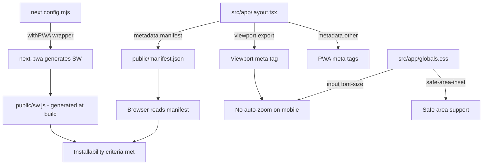

# Design Document: PWA & Mobile Optimization

## Overview

Fitur ini mengubah FinTrack menjadi Progressive Web App yang dapat diinstal dan mengoptimalkan tampilan mobile. Perubahan meliputi: (1) konfigurasi viewport Next.js untuk mencegah auto-zoom, (2) file `manifest.json` untuk installability, (3) meta tag PWA untuk iOS/Android, (4) service worker via `next-pwa` untuk caching dan offline fallback, (5) ikon aplikasi untuk home screen, (6) CSS safe area inset untuk perangkat bernotch, dan (7) penyesuaian `max-width` content container agar lebih efisien di desktop.

Pendekatan mengikuti arsitektur Next.js 14 App Router yang sudah ada. Tidak ada perubahan pada business logic, data model, atau fungsionalitas komponen yang ada.

## Architecture

### Pendekatan Umum

Semua perubahan bersifat konfigurasi dan presentasi — tidak ada perubahan pada data layer atau business logic. Perubahan terbagi menjadi:

1. **Next.js Metadata API** — viewport dan meta tag PWA dikonfigurasi melalui `export const viewport` dan `export const metadata` di `src/app/layout.tsx`
2. **Static Assets** — manifest.json dan ikon ditempatkan di `public/`
3. **next-pwa** — package yang menghasilkan service worker secara otomatis saat build
4. **CSS Global** — aturan untuk mencegah input zoom dan mendukung safe area inset
5. **Tailwind Utility** — penyesuaian max-width pada content container

### Alur Konfigurasi PWA



### File yang Terpengaruh

| File | Perubahan |
|------|-----------|
| `src/app/layout.tsx` | Update metadata + tambah viewport export |
| `src/app/globals.css` | Tambah aturan input font-size dan safe area |
| `next.config.mjs` | Wrap dengan `next-pwa` |
| `public/manifest.json` | **Baru** — web app manifest |
| `public/icons/icon-192x192.png` | **Baru** — ikon PWA 192px |
| `public/icons/icon-512x512.png` | **Baru** — ikon PWA 512px |
| `public/icons/apple-touch-icon.png` | **Baru** — ikon Apple 180px |
| `public/offline.html` | **Baru** — halaman offline fallback |
| `tailwind.config.ts` | Tidak berubah (safe-bottom sudah ada) |
| Semua halaman protected (`dashboard`, `transactions`, dll.) | Update max-width class |

## Components and Interfaces

### 1. Viewport Configuration (`src/app/layout.tsx`)

Next.js 14 mendukung export `viewport` terpisah dari `metadata`. Ini menghasilkan meta tag viewport yang tepat.

```typescript
import type { Metadata, Viewport } from "next";

export const viewport: Viewport = {
  width: 'device-width',
  initialScale: 1,
  maximumScale: 1,
  userScalable: false,
  viewportFit: 'cover',
};
```

Catatan: `maximumScale: 1` dan `userScalable: false` mencegah auto-zoom pada navigasi dan input focus. Ini trade-off aksesibilitas yang diterima karena FinTrack adalah aplikasi keuangan dengan UI yang sudah dioptimalkan untuk mobile, dan font-size input sudah 16px.

### 2. PWA Metadata (`src/app/layout.tsx`)

```typescript
export const metadata: Metadata = {
  title: "FinTrack - Keuangan Pribadi",
  description: "Aplikasi keuangan pribadi untuk pengguna Indonesia",
  manifest: '/manifest.json',
  appleWebApp: {
    capable: true,
    statusBarStyle: 'default',
    title: 'FinTrack',
  },
  other: {
    'mobile-web-app-capable': 'yes',
  },
  icons: {
    icon: [
      { url: '/icons/icon-192x192.png', sizes: '192x192', type: 'image/png' },
      { url: '/icons/icon-512x512.png', sizes: '512x512', type: 'image/png' },
    ],
    apple: [
      { url: '/icons/apple-touch-icon.png', sizes: '180x180', type: 'image/png' },
    ],
  },
};
```

### 3. Theme Color Meta Tag

Theme color dikonfigurasi melalui metadata. Karena FinTrack mendukung dark mode, idealnya theme-color berubah sesuai tema. Namun untuk simplisitas, gunakan warna hijau primer light mode sebagai default:

```typescript
// Di dalam metadata
themeColor: [
  { media: '(prefers-color-scheme: light)', color: '#628141' },
  { media: '(prefers-color-scheme: dark)', color: '#1E1E1A' },
],
```

### 4. Web App Manifest (`public/manifest.json`)

```json
{
  "name": "FinTrack - Keuangan Pribadi",
  "short_name": "FinTrack",
  "description": "Aplikasi keuangan pribadi untuk pengguna Indonesia",
  "start_url": "/",
  "display": "standalone",
  "orientation": "portrait",
  "theme_color": "#628141",
  "background_color": "#F5F2EB",
  "icons": [
    {
      "src": "/icons/icon-192x192.png",
      "sizes": "192x192",
      "type": "image/png",
      "purpose": "any maskable"
    },
    {
      "src": "/icons/icon-512x512.png",
      "sizes": "512x512",
      "type": "image/png",
      "purpose": "any maskable"
    }
  ]
}
```

### 5. next-pwa Configuration (`next.config.mjs`)

```javascript
import withPWAInit from 'next-pwa';

const withPWA = withPWAInit({
  dest: 'public',
  register: true,
  skipWaiting: true,
  disable: process.env.NODE_ENV === 'development',
  fallbacks: {
    document: '/offline.html',
  },
});

/** @type {import('next').NextConfig} */
const nextConfig = {};

export default withPWA(nextConfig);
```

`next-pwa` secara otomatis:
- Menghasilkan `sw.js` dan `workbox-*.js` di `public/` saat build
- Mendaftarkan service worker di browser
- Menerapkan strategi caching (cache-first untuk static assets, network-first untuk pages)
- Menyajikan `offline.html` saat offline

### 6. Offline Fallback Page (`public/offline.html`)

Halaman HTML statis sederhana yang ditampilkan saat pengguna offline:

```html
<!DOCTYPE html>
<html lang="id">
<head>
  <meta charset="UTF-8">
  <meta name="viewport" content="width=device-width, initial-scale=1.0">
  <title>FinTrack - Offline</title>
  <style>
    body {
      font-family: system-ui, sans-serif;
      display: flex;
      align-items: center;
      justify-content: center;
      min-height: 100vh;
      margin: 0;
      background: #F5F2EB;
      color: #1B211A;
    }
    .container {
      text-align: center;
      padding: 2rem;
    }
    h1 { color: #628141; }
    p { color: #4A5240; }
  </style>
</head>
<body>
  <div class="container">
    <h1>FinTrack</h1>
    <p>Anda sedang offline. Silakan periksa koneksi internet Anda dan coba lagi.</p>
  </div>
</body>
</html>
```

### 7. CSS Global — Input Zoom Prevention (`src/app/globals.css`)

iOS Safari auto-zoom pada input dengan font-size < 16px. Tambahkan aturan:

```css
/* Prevent auto-zoom on input focus (iOS Safari) */
input, textarea, select {
  font-size: 16px;
}

@supports (padding: env(safe-area-inset-bottom)) {
  .pb-safe-bottom {
    padding-bottom: env(safe-area-inset-bottom);
  }
}
```

Catatan: Tailwind config sudah memiliki `spacing: { "safe-bottom": "env(safe-area-inset-bottom)" }` yang menghasilkan `pb-safe-bottom`. BottomNav sudah menggunakan class ini. Aturan CSS di atas adalah fallback tambahan.

### 8. Content Container Width Adjustment

Saat ini semua halaman menggunakan `max-w-3xl` (768px). Untuk memanfaatkan ruang desktop lebih baik:

**Perubahan**: Ganti `max-w-3xl` menjadi `max-w-5xl` (1024px) pada semua halaman protected.

Halaman yang terpengaruh:
- `src/app/(protected)/dashboard/page.tsx`
- `src/app/(protected)/transactions/page.tsx`
- `src/app/(protected)/budgets/page.tsx`
- `src/app/(protected)/accounts/page.tsx`
- `src/app/(protected)/goals/page.tsx`
- `src/app/(protected)/reports/page.tsx`
- `src/app/(protected)/settings/page.tsx`

`max-w-5xl` (1024px) memberikan keseimbangan — konten lebih lebar di desktop tanpa menjadi terlalu lebar untuk dibaca, dan tetap responsif di mobile.

### 9. Ikon Aplikasi

Tiga file ikon PNG diperlukan:
- `public/icons/icon-192x192.png` — ikon standar PWA
- `public/icons/icon-512x512.png` — ikon splash screen PWA
- `public/icons/apple-touch-icon.png` — ikon Apple (180x180)

Desain ikon: latar belakang hijau (`#628141`) dengan huruf "F" putih di tengah, rounded corners. Ikon dibuat sebagai SVG lalu dikonversi ke PNG, atau langsung dibuat sebagai PNG sederhana menggunakan canvas/script.

## Data Models

Tidak ada perubahan pada data model. Fitur ini murni konfigurasi frontend dan presentasi.

## Correctness Properties

*Correctness property adalah karakteristik atau perilaku yang harus berlaku di semua eksekusi valid dari sebuah sistem — pada dasarnya, pernyataan formal tentang apa yang seharusnya dilakukan sistem. Property berfungsi sebagai jembatan antara spesifikasi yang dapat dibaca manusia dan jaminan kebenaran yang dapat diverifikasi mesin.*

Sebagian besar acceptance criteria pada fitur ini bersifat konfigurasi statis (meta tag, manifest fields, file existence) yang paling tepat divalidasi dengan unit test example-based. Satu property universal teridentifikasi:

### Property 1: Manifest berisi semua field wajib PWA

*For any* valid PWA manifest, file `manifest.json` SHALL mengandung semua field wajib (`name`, `short_name`, `description`, `start_url`, `display`, `theme_color`, `background_color`, `icons`) dan field `display` bernilai `standalone`, field `start_url` bernilai `/`, serta array `icons` mengandung minimal entry berukuran 192x192 dan 512x512.

**Validates: Requirements 2.1, 2.2, 2.3, 2.4, 2.5**

### Property 2: Semua halaman protected menggunakan content container yang lebih lebar

*For any* halaman di dalam direktori `src/app/(protected)/`, content container utama SHALL menggunakan class `max-w-5xl` (bukan `max-w-3xl`), sehingga konten memanfaatkan ruang layar desktop secara efisien.

**Validates: Requirements 6.1, 6.3**

## Error Handling

### Service Worker Gagal Mendaftar

- Jika browser tidak mendukung service worker atau registrasi gagal, aplikasi tetap berfungsi normal sebagai web app biasa
- `next-pwa` menangani graceful degradation secara otomatis
- Tidak ada error yang ditampilkan ke pengguna — PWA features hanya tidak tersedia

### Manifest Tidak Ditemukan

- Jika `manifest.json` gagal dimuat, browser tidak menampilkan prompt "Add to Home Screen"
- Aplikasi tetap berfungsi normal tanpa fitur installability
- Tidak ada error yang ditampilkan ke pengguna

### Offline State

- Saat offline, service worker menyajikan `offline.html` untuk navigasi yang tidak ada di cache
- API calls akan gagal — komponen yang menggunakan React Query sudah menangani error state
- Tidak ada perubahan pada error handling komponen yang ada

### Ikon Tidak Ditemukan

- Jika file ikon tidak ada, browser menggunakan favicon default atau tidak menampilkan ikon
- Tidak ada error yang ditampilkan ke pengguna

## Testing Strategy

### Unit Tests (example-based)

Karena fitur ini sebagian besar bersifat konfigurasi statis, unit test fokus pada verifikasi keberadaan dan kebenaran konfigurasi:

1. **Manifest validation test** (`__tests__/manifest.test.ts`):
   - Parse `public/manifest.json` dan verifikasi semua field wajib ada
   - Verifikasi `display === 'standalone'`
   - Verifikasi `start_url === '/'`
   - Verifikasi icons array mengandung ukuran 192x192 dan 512x512
   - Verifikasi `theme_color` dan `background_color` sesuai tema

2. **Layout metadata test** (`__tests__/layout-metadata.test.ts`):
   - Import `viewport` dan `metadata` dari `src/app/layout.tsx`
   - Verifikasi viewport memiliki `width`, `initialScale`, `viewportFit`
   - Verifikasi metadata memiliki `manifest`, `appleWebApp`, `themeColor`, `icons`

3. **Content container width test**:
   - Verifikasi semua halaman protected menggunakan `max-w-5xl`
   - Ini bisa dilakukan sebagai grep/static analysis test

### Property-Based Tests (menggunakan fast-check)

Fitur ini memiliki sedikit logika yang cocok untuk property-based testing karena sebagian besar perubahan bersifat konfigurasi statis. Property 2 (content container width) paling cocok divalidasi sebagai static analysis test yang memeriksa semua file halaman.

### Test Dependencies

- `vitest` — sudah terinstal sebagai test runner
- `fast-check` — sudah terinstal (dari spec sebelumnya)
- Tidak ada dependency test baru yang diperlukan
