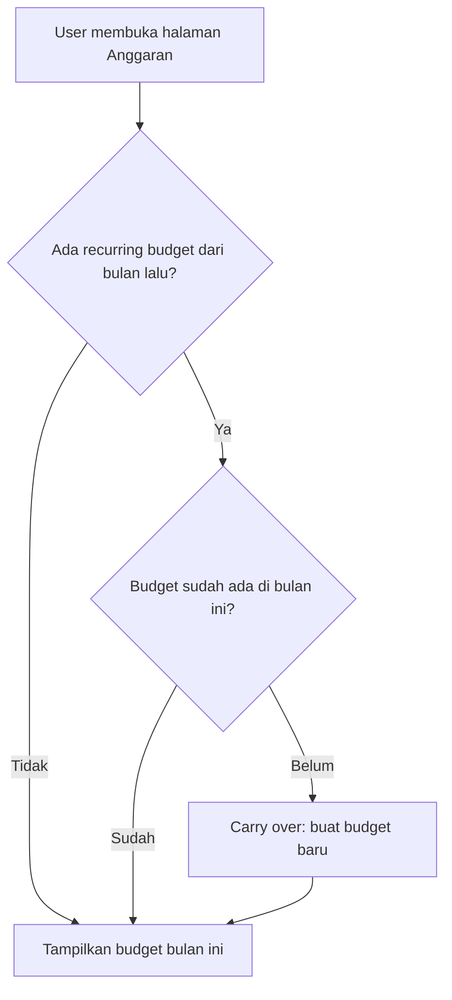
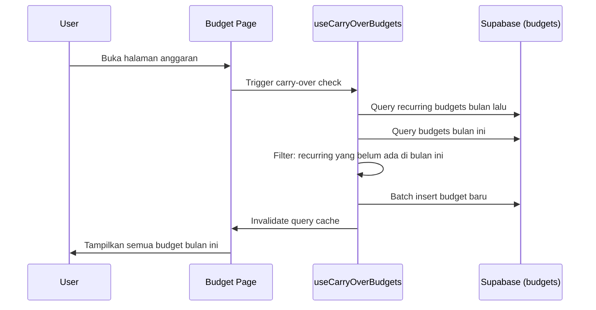

# Design Document: Recurring Budget

## Overview

Fitur Recurring Budget menambahkan kemampuan bagi pengguna untuk menandai anggaran sebagai "berulang", sehingga anggaran tersebut otomatis di-carry over ke periode berikutnya. Implementasi melibatkan:

1. Penambahan kolom `is_recurring` pada tabel `budgets`
2. Modifikasi BudgetForm untuk menampilkan toggle recurring
3. Logika carry-over yang berjalan saat pengguna mengakses halaman anggaran di periode baru
4. Modifikasi hook `useCreateBudget` dan `useUpdateBudget` untuk mendukung field baru

Pendekatan carry-over menggunakan strategi "lazy generation" — budget baru dibuat saat pengguna mengakses halaman anggaran, bukan melalui cron job atau scheduled function. Ini menghindari kompleksitas infrastruktur tambahan dan tetap responsif karena pengguna pasti membuka halaman anggaran saat ingin melihat budget mereka.

## Architecture



### Strategi Carry-Over: Lazy Generation

- Carry-over dilakukan di client-side saat halaman anggaran dimuat
- Hook `useCarryOverBudgets` memeriksa apakah ada recurring budget dari bulan sebelumnya yang belum ada di bulan berjalan
- Jika ada, budget baru dibuat secara batch insert
- Pendekatan ini sederhana, tidak memerlukan infrastruktur tambahan (edge functions, cron), dan idempoten

### Alur Data



## Components and Interfaces

### 1. Database Migration (`00012_recurring_budget.sql`)

Menambahkan kolom `is_recurring` ke tabel `budgets`.

### 2. Type Update (`src/types/index.ts`)

```typescript
export interface Budget {
  id: string;
  user_id: string;
  category_id: string;
  month: string;
  limit_amount: number;
  is_recurring: boolean; // NEW
  created_at: string;
  updated_at: string;
}
```

### 3. BudgetForm Enhancement (`src/components/budgets/BudgetForm.tsx`)

- Tambahkan state `isRecurring` (boolean)
- Tambahkan checkbox/toggle "Anggaran Berulang" di form
- Sertakan `is_recurring` dalam data yang di-submit

```typescript
// Updated onSubmit data shape
interface BudgetFormData {
  category_id: string;
  month: string;
  limit_amount: number;
  is_recurring: boolean; // NEW
}
```

### 4. Hook: `useCarryOverBudgets` (`src/hooks/useCarryOverBudgets.ts`)

Hook baru yang menangani logika carry-over:

```typescript
interface CarryOverResult {
  carriedOver: number; // jumlah budget yang di-carry over
  isLoading: boolean;
  error: Error | null;
}

function useCarryOverBudgets(
  currentMonth: string,
  cutoffDate: number
): CarryOverResult;
```

Logika:
1. Hitung bulan sebelumnya dari `currentMonth`
2. Query semua budget dengan `is_recurring = true` di bulan sebelumnya
3. Query semua budget di bulan berjalan
4. Filter recurring budgets yang `category_id`-nya belum ada di bulan berjalan
5. Untuk setiap budget yang perlu di-carry over, ambil `limit_amount` terbaru (dari bulan terakhir)
6. Batch insert budget baru
7. Invalidate budget query cache

### 5. Hook Updates: `useCreateBudget` dan `useUpdateBudget`

- `useCreateBudget`: Tambahkan `is_recurring` ke insert payload
- `useUpdateBudget`: Tambahkan `is_recurring` ke update payload

### 6. Utility: `getPreviousMonth` (`src/lib/cycle-utils.ts`)

```typescript
/**
 * Menghitung budget month sebelumnya.
 * Input: "2024-03-01" → Output: "2024-02-01"
 * Input: "2024-01-01" → Output: "2023-12-01"
 */
function getPreviousMonth(budgetMonth: string): string;
```

## Data Models

### Tabel `budgets` (Updated)

| Column | Type | Constraint | Default | Keterangan |
|--------|------|-----------|---------|------------|
| id | UUID | PK | gen_random_uuid() | |
| user_id | UUID | FK → auth.users, NOT NULL | | |
| category_id | UUID | FK → categories, NOT NULL | | |
| month | DATE | NOT NULL | | Budget month (YYYY-MM-01) |
| limit_amount | BIGINT | NOT NULL, CHECK > 0 | | Nominal anggaran dalam IDR |
| is_recurring | BOOLEAN | NOT NULL | FALSE | Flag recurring |
| created_at | TIMESTAMPTZ | NOT NULL | now() | |
| updated_at | TIMESTAMPTZ | NOT NULL | now() | |

Constraint: UNIQUE (user_id, category_id, month) — sudah ada, mencegah duplikasi saat carry-over.

### Carry-Over Data Flow

```
Budget bulan lalu (is_recurring=true, limit_amount=X)
    ↓ carry-over
Budget bulan ini (is_recurring=true, limit_amount=X, category_id sama)
```

Jika user edit limit_amount di bulan ini menjadi Y, maka carry-over bulan depan akan menggunakan Y.


## Correctness Properties

*A property is a characteristic or behavior that should hold true across all valid executions of a system — essentially, a formal statement about what the system should do. Properties serve as the bridge between human-readable specifications and machine-verifiable correctness guarantees.*

### Property 1: Flag is_recurring tersimpan dengan benar

*For any* budget yang dibuat atau diperbarui, nilai `is_recurring` yang dikirim harus sama dengan nilai yang tersimpan di database. Jika tidak ada nilai yang dikirim, default-nya adalah FALSE.

**Validates: Requirements 1.1, 1.2, 2.2**

### Property 2: Carry-over hanya untuk recurring budgets

*For any* kumpulan budget di bulan M di mana sebagian memiliki `is_recurring=true` dan sebagian `is_recurring=false`, ketika carry-over dijalankan untuk bulan M+1, maka hanya budget dengan `is_recurring=true` yang menghasilkan budget baru di bulan M+1, dengan `category_id` yang sama dan `is_recurring=true`.

**Validates: Requirements 3.1, 3.3, 3.5, 5.1, 5.2**

### Property 3: Carry-over bersifat idempoten

*For any* state database, menjalankan carry-over dua kali berturut-turut untuk bulan yang sama harus menghasilkan state yang identik dengan menjalankannya sekali. Tidak ada duplikasi budget yang terjadi.

**Validates: Requirements 3.4**

### Property 4: Last amount selection

*For any* recurring budget dengan kategori C milik user U, jika terdapat beberapa budget recurring untuk kategori C di bulan-bulan berbeda, carry-over harus menggunakan `limit_amount` dari budget dengan `month` terbesar (paling akhir).

**Validates: Requirements 4.1, 4.2, 4.3**

### Property 5: Menonaktifkan recurring menghentikan carry-over

*For any* budget yang sebelumnya `is_recurring=true` lalu diubah menjadi `is_recurring=false`, budget tersebut tidak boleh muncul dalam hasil carry-over bulan berikutnya.

**Validates: Requirements 2.4**

## Error Handling

| Skenario | Penanganan |
|----------|-----------|
| Carry-over gagal (network error) | Tampilkan toast error, budget tetap bisa dilihat tanpa carry-over. Carry-over akan dicoba lagi saat halaman di-refresh. |
| Duplikasi saat carry-over (constraint violation 23505) | Skip budget tersebut tanpa error — artinya budget sudah ada. |
| User menghapus budget yang sudah di-carry over | Budget dihapus normal. Carry-over tidak akan membuat ulang karena budget bulan ini sudah pernah ada (atau user bisa buat manual). |
| Invalid is_recurring value | Database constraint BOOLEAN memastikan hanya TRUE/FALSE yang valid. |

## Testing Strategy

### Property-Based Testing

Library: **fast-check** (sudah tersedia di ekosistem project)

Konfigurasi:
- Minimum 100 iterasi per property test
- Setiap test di-tag dengan referensi ke property di design document

Format tag: `Feature: recurring-budget, Property {number}: {property_text}`

Property tests yang akan diimplementasi:
1. **Property 1**: Generate random budget creation inputs, verify is_recurring persistence
2. **Property 2**: Generate random sets of budgets (mix recurring/non-recurring), run carry-over logic, verify only recurring ones appear in next month
3. **Property 3**: Generate random budget state, run carry-over twice, verify identical results
4. **Property 4**: Generate recurring budgets across multiple months with different amounts, verify carry-over uses the latest amount
5. **Property 5**: Generate recurring budgets, disable some, run carry-over, verify disabled ones excluded

### Unit Testing

Unit tests fokus pada:
- Edge case: carry-over saat tidak ada recurring budget (hasilnya kosong)
- Edge case: carry-over di bulan Januari (tahun berubah)
- Edge case: semua kategori sudah ada di bulan baru (tidak ada yang di-carry over)
- Rendering: BudgetForm menampilkan toggle recurring
- Rendering: BudgetForm menampilkan state is_recurring saat edit
- Integration: useCreateBudget menyertakan is_recurring dalam payload
- Integration: useUpdateBudget menyertakan is_recurring dalam payload

### Test Structure

```
src/
├── hooks/__tests__/
│   ├── useCarryOverBudgets.test.ts      # Unit + property tests
│   └── useCreateBudget.recurring.test.ts # Unit tests for recurring flag
├── components/budgets/__tests__/
│   └── BudgetForm.recurring.test.tsx     # UI toggle tests
└── lib/__tests__/
    └── carryOver.property.test.ts        # Pure logic property tests
```
